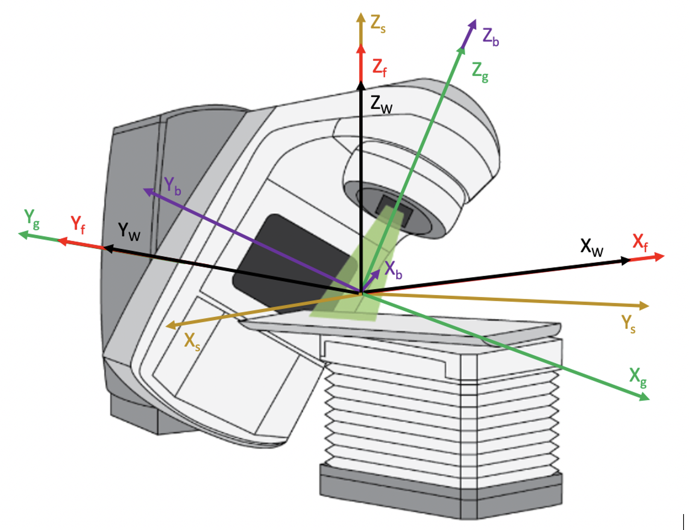
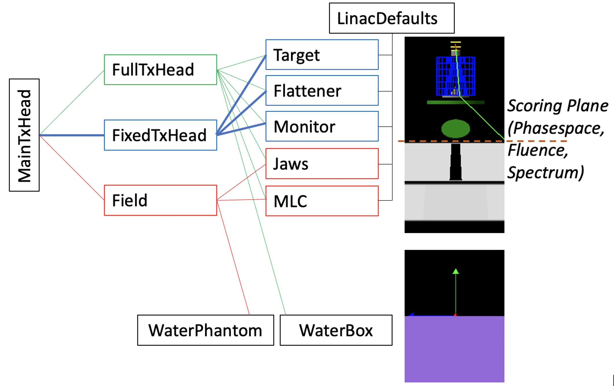

Linear Accelerator Treatment Head Simulation
--------------------------------------------

This example is intended for both demonstration purposes and to provide an excellent starting point for simulation of most any linear accelerator (linac) treatment head. A Siemens Oncor treatment head is simulated. The co-ordinate systems, shown in the figure below, are in compliance with IEC 61217. Note that the use of directional bremsstrahlung splitting and other variance reduction techniques (VRTs), essential for efficient simulation, requires a gantry angle of zero degrees; that is, the region used to specify the preferred bremsstrahlung direction is positioned along the Z axis in the Geant4 world co-ordinate system (Z\ :sub:`W`\ ).

   TOPAS linac example co-ordinate systems, compliant with IEC 61217. The relationship between the Geant4 world coordinates and the IEC fixed, gantry, beam limiting device and patient support systems is shown in the diagram. The Geant4 world co-ordinate system (X\ :sub:`W`\ , Y\ :sub:`W`\ , Z\ :sub:`W`\ ), shown in black, coincides with the IEC fixed system (X\ :sub:`f`\ , Y\ :sub:`f`\ , Z\ :sub:`f`\ ), shown in red. The machine isocenter, the origin of the world and IEC co-ordinate systems, coincides with the intersection of the axis of rotation of the collimator and gantry (discounting gantry sag, wobble in the collimator bearing, etc.). The IEC gantry system in green (X\ :sub:`g`\ , Y\ :sub:`g`\ , Z\ :sub:`g`\ ), provides for gantry rotation about Y\ :sub:`g`\  (coincident with Y\ :sub:`f`\ ). The IEC beam limiting device system in purple (X\ :sub:`b`\ , Y\ :sub:`b`\ , Z\ :sub:`b`\ ) provides for collimator rotation about Z\ :sub:`b`\  (coincident with Z\ :sub:`g`\ ). The IEC patient support system in orange (X\ :sub:`s`\ , Y\ :sub:`s`\ , Z\ :sub:`s`\ ) provides for couch rotation about Z\ :sub:`s`\  (coincident with Z\ :sub:`f`\ ). 

The geometry is that of a Siemens Oncor machine. The material and geometry of the exit window, target and monitor chamber, are from Jabbari et al, "Monte Carlo simulation of Siemens ONCOR linear accelerator with BEAMnrc and DOSXYnrc code," J Med Signals & Sensors, 3(3):172-9, 2013. The source details and the rest of the geometry are from Sawkey and Faddegon, "Simulation of large x-ray fields using independently measured source and geometry details," Med Phys 36(12):5622-32 and references therein. This latter publication provides our recommended procedure for accurate simulation of linac x-ray beams. For electron beams, refer to Tuathan P O'Shea, Daren L Sawkey, Mark J Foley, Bruce A Faddegon, "Monte Carlo commissioning of clinical electron beams using large field measurements," Phys. Med. Biol. 55:4083–4105, 2010, PMID: 20601775 and references therein. An excellent reference on this topic is Ma et al, "Beam modeling and beam model commissioning for MC dose calculation based radiation therapy treatment planning - The AAPM Task Group 157 Report,". Med. Phys. 47 (1):e1-e18, 2020.

The position of each major component in the treatment head is provided by the user as the distance from the nominal target position to the upstream surface of the component. The nominal target position is a distance of the source-axis distance (SAD) from the machine isocenter along Z\ :sub:`f`\ . The major components are the exit window, target, primary collimator, flattening filter, monitor chamber, mirror, a pair of asymmetric jaws and the opposing banks of the doubly diverging multi-leaf collimator (MLC). The direction of travel of the jaws and MLC is specified as either X\ :sub:`b`\  or Y\ :sub:`b`\ . The distance of travel is specified as the field size setting or MLC leaf position setting; that is, the position of the jaw or MLC leaf as projected to the plane of isocenter, perpendicular to the gantry rotation axis Z\ :sub:`g`\ . This is the setting generally given in the planning system or at the treatment machine.

The full set of parameter control files provided with the linac example are shown in the figure below. Three separate parameter control files are provided in :ref:`example_linac_maintxhead`. Only one of these files should be selected at a time. The file selection in the TOPAS distribution is :ref:`example_linac_fulltxhead`. This file is used for simulation of the full treatment head. In this case, the TOPAS GUI is used to observe particles traversing the treatment head from the electron source upstream of the exit window, through the fixed (blue) and variable (red) portions, into a water box. Changeable parameters are available in the GUI to observe their effect on the simulation. 

   TOPAS linac example parameter control file hierarchy. Parameter values set in files to the right in the figure, the defaults, are overridden if they are set in files to the left. For example, all adjustable patient-specific field settings are contained in Field.txt including gantry angle, collimator angle, and jaw and MLC leaf positions.

The following command makes the assumption that your TOPAS executable resides in ``/Applications/topas/bin/topas``. To begin the simulation from the command line in your terminal window, change the directory to the directory containing the parameter control files for the linac example, and enter the following from the command line::

    /Applications/topas/bin/topas MainTxHead.txt

It is common practice to generate phase-space data along a plane situated between the fixed and movable portions of the treatment head for all energies and beam types (x-rays with or without flattening filter, electrons) available on the linac and to use the stored phase-space data for field-dependent simulations. The full treatment head simulation is easily broken into two parts for this purpose: the fixed portion of the treatment head upstream of the jaws, and the field portion of the treatment head for simulation with patient-specific field settings. In this example, the field portion consists of an asymmetric pair of jaws and an MLC. The fixed portion is used to generate a phase-space file containing the energy, position and direction of all particles that reach the Scoring Plane positioned, as shown in the figure, just upstream of the jaws. The particle source for the field-dependent simulations is the phase-space file generated from the fixed treatment head simulation. Long runs may be done in the fixed portion to record a sufficient number of x-rays in phase space files for high precision runs in the field portion, without repeating simulation of the fixed portion. An important advantage of pre-calculated phase-space files is to provide confidence in the accuracy of the results (dose distributions) calculated with this source data, as this can be pre-determined through a commissioning procedure with simulations of different field sizes, source-to-surface distances, and so on.

Two additional parameter control files are provided for this purpose: :ref:`example_linac_fixedtxhead` and :ref:`example_linac_field`. In order to run the simulation with :ref:`example_linac_fixedtxhead`, edit :ref:`example_linac_maintxhead` to comment out the line ``include FullTxHead.txt`` and remove the comment character "#" from the line ``#include FixedTxHead.txt``. Then, enter the same command on the command line as used previously::

    /Applications/topas/bin/topas MainTxHead.txt

This time the TOPAS GUI will not be initiated, but instead a large number of histories will be run. Uniform bremsstrahlung splitting, a VRT to improve calculation efficiency, will be utilized to generate a phase-space file with a large number of source particles for the field-dependent portion of the simulation.

Once this simulation is complete, in order to run the simulation with :ref:`example_linac_field`, edit :ref:`example_linac_maintxhead` to comment out the line ``include FixedTxHead.txt`` and remove the comment character "#" from the line ``#include Field.txt``. Then, enter the same command on the command line as used previously, this time to run the variable field portion of the treatment head simulation::

    /Applications/topas/bin/topas MainTxHead.txt

Again, the TOPAS GUI will not be initiated. All of the particles in the phase space from the fixed portion of the simulation will be run for the field-dependent portion of the simulation and a dose distribution scored in a water phantom positioned with its surface at the SAD. 

The following include files are available in :ref:`example_linac_maintxhead`. Only one of these should selected at a time:

     1.	:ref:`example_linac_fulltxhead`: Simulation of the full treatment head from the electron source position in vacuum through the fixed and variable portions of the treatment head, into a water box, with the water surface coinciding with the machine isocenter. While a few parameters are set in :ref:`example_linac_fulltxhead`, most are set in include files used in both the full treatment head simulation and the next two simulations. Simulation parameters may be changed, for example, to simulate a different treatment head. Parameters set in :ref:`example_linac_fulltxhead` include graphics parameters, the random number seed, the SAD, and the electron source details of mean energy and peak width, width of the angular distribution, and spot size. The TOPAS GUI is set to display the linac and run the simulation. Field-dependent parameters in Field.txt will need to be changed there, as those parameters in :ref:`example_linac_jaws` and :ref:`example_linac_mlc` are overridden in :ref:`example_linac_field`. 
     2.	:ref:`example_linac_fixedtxhead`: Simulation of the fixed components of the linac, with phase-space scored on a plane perpendicular to the primary collimator axis just upstream of the jaws. Uniform bremsstrahlung splitting variance reduction is used to improve the efficiency of the simulation. The parameter file is set to run a large number of histories without displaying the simulation (this may be changed in :ref:`example_linac_fixedtxhead`). 
     3.	:ref:`example_linac_field`: Simulation of a field with specific gantry and collimator angles, jaw and MLC leaf positions. The parameter file is set to run the pre-recorded phase-space from the second example, without displaying the simulation (this may be changed in :ref:`example_linac_field`). The phase-space is repeated several times to improve statistical precision.

Additional parameter control files are used to set default parameter values for the fixed and variable components in the treatment head. In general, once set for a particular treatment machine, these parameters need not be changed again. The parameter control files used to provide values for the parameters of the various fixed components are:

     1.	:ref:`example_linac_target`: Exit window and target.
     2.	:ref:`example_linac_flattener`: Primary collimator and flattener. Edit this file to use a different flattener when using a different beam energy, or to simulate an unflattened beam.  	
     3.	:ref:`example_linac_monitor`: Monitor chamber

The parameter control files used to provide values for the parameters of the various field-dependent and patient-dependent components follow. :ref:`example_linac_field` is provided to override field-dependent values set in these parameter control files.

     1.	:ref:`example_linac_jaws`: All jaw parameters. 	
     2.	:ref:`example_linac_mlc`: All MLC parameters. 		
     3.	:ref:`example_linac_waterbox`: A simple one region water box, intended for display purposes in :ref:`example_linac_fulltxhead`. Use of a large number of regions (voxels) is discouraged when using the GUI, since this can take an inordinate amount of time to process and display. 
     4.	:ref:`example_linac_waterphantom`: A multi-voxel water phantom used in :ref:`example_linac_field` to score dose distributions. 
     5.	:ref:`example_linac_linacdefaults`: This file is required to provide default values of certain parameters to allow users to set preferred values of these parameters in higher level include files. 
A set of parameter control files are provided to score information about the simulated beam on the scoring plane positioned just upstream of the jaws: 
     1.	:ref:`example_linac_scorephasespace`: Default in :ref:`example_linac_fixedtxhead`.
     2.	:ref:`example_linac_scoreenergyfluence`: An option is provided, for demonstration purposes, to score the spatial distribution of energy fluence in :ref:`example_linac_fixedtxhead`. 
     3.	:ref:`example_linac_scoreenergyspectrum`: An option is provided, for demonstration purposes, to score the energy spectrum in :ref:`example_linac_fixedtxhead`. 

