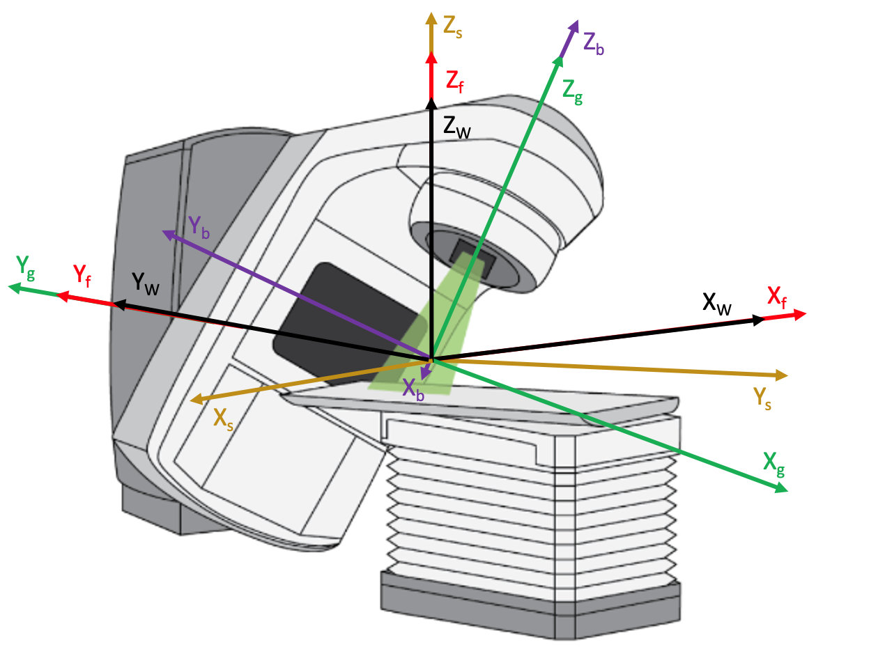
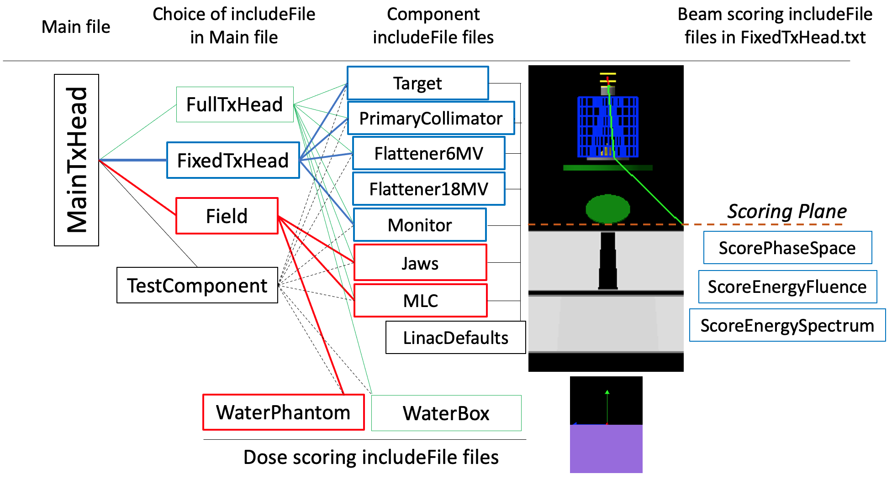

Linear Accelerator Treatment Head Simulation
--------------------------------------------

This example is intended for both demonstration purposes and to provide an excellent starting point for simulation of the treatment head of most any linear accelerator (linac) used in radiotherapy. A Siemens Oncor treatment head is simulated. The co-ordinate systems used in the example, shown in the figure below, are in compliance with IEC 61217. Note that the use of directional bremsstrahlung splitting and other variance reduction techniques (VRTs), essential for efficient simulation, requires a gantry angle of zero degrees since the region used to specify the preferred bremsstrahlung direction is positioned along Z\ :sub:`W`\, the Z axis in the Geant4 world co-ordinate system.

  The co-ordinate systems used in the linac example that are compliant with IEC 61217 are placed relative to the Geant4 world co-ordinates (W) as shown in the diagram: Fixed (f), gantry (g), beam limiting devices (b) and patient support (S). Yw and Yf are along the gantry rotation axis, Zw, Zf, and Zs are vertical, along the table rotation axis. The coordinates conform to the right-hand rule.

The relationship between the Geant4 world coordinate system and the IEC fixed, gantry, beam limiting device and patient support coordinate systems is shown in the above diagram. The machine isocenter is at the origin of the world and IEC co-ordinate systems, coinciding with the intersection of the axes of rotation of the collimator and gantry (discounting gantry sag, wobble in the gantry and collimator bearings, etc.). The Geant4 world coordinates in black (X\ :sub:`W`\ , Y\ :sub:`W`\ , Z\ :sub:`W`\ ) coincide with the IEC fixed coordinates in red (X\ :sub:`f`\ , Y\ :sub:`f`\ , Z\ :sub:`f`\ ). The IEC gantry coordinates in green (X\ :sub:`g`\ , Y\ :sub:`g`\ , Z\ :sub:`g`\ ) provide for gantry rotation about Y\ :sub:`g`\ (coincident with Y\ :sub:`f`\ ), in the sense of Z\ :sub:`f`\  to X\ :sub:`f`\. The IEC beam limiting device coordinates in purple (X\ :sub:`b`\ , Y\ :sub:`b`\ , Z\ :sub:`b`\ ) provide for collimator rotation about Z\ :sub:`b`\  (coincident with Z\ :sub:`g`\ ), in the sense of X\ :sub:`b`\  to Y\ :sub:`b`\ . The IEC patient support coordinates in orange (X\ :sub:`s`\ , Y\ :sub:`s`\ , Z\ :sub:`s`\ ) provide for couch rotation about Z\ :sub:`s`\ (coincident with Z\ :sub:`f`\), in the sense of X\ :sub:`s`\  to Y\ :sub:`s`\ .

The material and geometry of the exit window, target and monitor chamber are from Jabbari et al, "Monte Carlo simulation of Siemens ONCOR linear accelerator with BEAMnrc and DOSXYnrc code," J Med Signals & Sensors, 3(3):172-9, 2013. The source details and the rest of the geometry are from Sawkey and Faddegon, "Simulation of large x-ray fields using independently measured source and geometry details," Med Phys 36(12):5622-32 and references therein, supplemented with direct measurement. The latter publication provides our recommended procedure for accurate simulation of linac x-ray beams. For accurate simulation of electron beams, refer to Tuathan P O'Shea, Daren L Sawkey, Mark J Foley, Bruce A Faddegon, "Monte Carlo commissioning of clinical electron beams using large field measurements," Phys. Med. Biol. 55:4083–4105, 2010, PMID: 20601775 and references therein. Other helpful references include Ma et al, "Beam modeling and beam model commissioning for MC dose calculation based radiation therapy treatment planning - The AAPM Task Group 157 Report," Med. Phys. 47 (1):e1-e18, 2020 and “Monte Carlo Techniques in Radiotherapy,” ed. J Seco and F Verhaegen, Nov 14, 2021, Taylor & Francis Books, Inc.

The position of each major component in the treatment head is provided by the user as the distance from the nominal target position to the upstream surface of the component. The nominal target position is at a distance of the source-axis distance (SAD) from the machine isocenter along Z\ :sub:`f`\ . The major components are the exit window, target, primary collimator, flattening filter, monitor chamber, mirror, a pair of asymmetric jaws and opposing banks of a doubly diverging multi-leaf collimator (MLC). The axis of travel of the jaws and MLC is specified as either X\ :sub:`b`\  or Y\ :sub:`b`\ . The distance of travel is specified as the field size setting or MLC leaf position setting; that is, the position of the jaw or MLC leaf as projected to the plane containing the isocenter and perpendicular to the gantry rotation axis Z\ :sub:`g`\ . These are the setting generally given in the planning system or at the treatment machine.

The full set of parameter control files provided with the linac example are shown in the figure below. Three distinctly separate simulations are provided in MainTxHead.txt through the selection of one and only one of FullTxHead.txt, FixedTxHead.txt or Field.txt. The file selection in the TOPAS distribution is FullTxHead.txt. This file is used for simulation of the full treatment head. In this case, the TOPAS GUI is set to be used to observe particles traversing the treatment head from the electron source upstream of the exit window, through the fixed positions (shown in blue) and variable portions (shown in red) of the treatment head, into a water box. Changeable parameters are available in the GUI to observe their effect on the simulation. 

  Filenames of the parameter control files comprising the TOPAS linac example (filetype .txt). Parameter values set in files to the left override those in files to the right. For example, patient-specific field settings for the gantry and collimator angles and the jaw and MLC leaf positions contained in Field.txt override the settings in the component parameter control files Jaws.txt and MLC.txt. Two flattening filters are provided, Flattener6MV.txt and Flattener18MV.txt.  Files for scoring beam quantities and dose are provided. Files used to take advantage of various variance reduction techniques are also provided. These are shown on the left side of the diagram as they have MainTxHead.txt as an includeFile. 

The following command makes the assumption that your TOPAS executable resides in ``/Applications/topas/bin/topas``. To begin the simulation from the command line in your terminal window, change the directory to the directory containing the parameter control files for the linac example, and enter the following from the command line::

    /Applications/topas/bin/topas MainTxHead.txt

It is common practice to generate phase-space data along a plane situated between the fixed and movable portions of the treatment head for all energies and beam types (x-rays with or without flattening filter, electrons) available on the linac and to use the stored phase-space data for field-dependent simulations. The full treatment head simulation may be broken into two parts for this purpose: the fixed portion of the treatment head upstream of the jaws, and the field portion of the treatment head for simulation with patient-specific field settings. In this example, the fixed portion is used to generate a phase-space file containing the energy, position and direction of all particles that reach the Scoring Plane positioned, as shown in the figure, just upstream of the jaws. The field portion consists of an asymmetric pair of jaws and an MLC. The particle source for these field-dependent simulations is the phase-space file generated from the fixed treatment head simulation. Long runs may be done in the fixed portion to record a sufficient number of x-rays in phase space files for high precision runs in the field portion, without repeating simulation of the fixed portion. An important advantage of pre-calculated phase-space files is to provide confidence in the accuracy of the results calculated with this source data, such as dose distributions, as this can be pre-determined through a commissioning procedure with simulations covering the clinical range of field size, source-to-surface distance, and so on.

Two additional parameter control files are provided for this purpose: FixedTxHead.txt and Field.txt. In order to run the simulation with FixedTxHead.txt, edit MainTxHead.txt to comment out the line ``#include FullTxHead.txt`` by adding the comment character "#" at the start of the line and remove the comment character from the line ``#include FixedTxHead.txt``. Then, enter the same command on the command line as used previously::

    /Applications/topas/bin/topas MainTxHead.txt

This time the TOPAS GUI will not be initiated, but instead a large number of histories will be run. Uniform bremsstrahlung splitting, a VRT to improve calculation efficiency, will be utilized to generate a phase-space file with a large number of source particles for the field-dependent portion of the simulation.

Once this simulation is complete, in order to run the simulation with Field.txt, edit MainTxHead.txt to comment out the line ``include FixedTxHead.txt`` and remove the comment character ``#`` from the line ``#include Field.txt``. Then, enter the same command on the command line as used previously, this time to run the variable field portion of the treatment head simulation::

    /Applications/topas/bin/topas MainTxHead.txt

Again, the TOPAS GUI will not be initiated. All of the particles in the phase space from the fixed portion of the simulation will be run for the field-dependent portion of the simulation and a dose distribution will be scored in a water phantom positioned with its surface at the SAD. 

The following include files are available in :ref:`example_linac_maintxhead`. Only one of these should be selected at a time:

     1. FullTxHead.txt: Simulation of the full treatment head from the electron source position in vacuum through the fixed and variable portions of the treatment head, into a water box, with the water surface coinciding with the machine isocenter. While a few parameters are set in FullTxHead.txt, most are set in the component includeFile files. Simulation parameter values in these files may be changed, for example, to simulate a treatment head from a different vendor. Parameters set in FullTxHead.txt include graphics parameters, the random number seed, the SAD, and the electron source details of mean energy and peak width, width of the angular distribution, and spot size. The TOPAS GUI is set to display the linac and run the simulation. 	
     2. FixedTxHead.txt: Simulation of the fixed components of the linac, with phase-space scored on a plane perpendicular to the primary collimator axis just upstream of the jaws. Uniform bremsstrahlung splitting variance reduction is used to improve the efficiency of the simulation. The parameter file is set to run a large number of histories without displaying the simulation. The electron source for the 6 MV Oncor x-ray beam is given by default. The electron source for the 18 MV Oncor x-ray beam is available, commented out. The Siemens Oncor flattener for the 18 MV x-ray beam is provided in Flattener18MV.txt (available as an includeFile in place of the Flattener6MV.txt includeFile). 	
     3. Field.txt: Simulation of a field with specified gantry and collimator angles, and jaw and MLC leaf positions. The parameter file is set to run the pre-recorded phase-space recorded from the second example (FixedTxHead.txt), without displaying the simulation. The phase-space is repeated multiple times to improve statistical precision. 	
     4. TestComponent.txt: This parameter control file is provided for users to easily display components in the TOPAS GUI separately or together, to visually see changes the user makes in the default parameters for each component, discussed next. Either an electron pencil beam source or a photon point source may be selected to test components with or without a target.

Additional parameter control files are used to set default parameter values for the fixed and variable components in the treatment head. In general, once set for a particular treatment machine, these parameters need not be changed again. Any field-specific settings can be changed in FullTxHead.txt or Field.txt. 

The parameter control files used to provide values for the parameters of the various fixed components are:

    1. Target.txt: Exit window and target.
    2. PrimaryCollimator.txt: Primary collimator.  	
    3. Flattener6MV.txt: Flattener for 6 MV x-ray beam. Comment out this includeFile in FullTxHead.txt or FixedTxHead.txt to simulate an unflattened beam.  	
    4. Flattener18MV.txt: Flattener for 18 MV x-ray beam. Replace the Flattener6MV.txt includeFile with Flattener18MV.txt in FullTxHead.txt or FixedTxHead.txt and change source parameter values as shown in FixedTxHead.txt to simulate an 18 MV flattened beam.  	
    5. Monitor.txt: Monitor chamber with mirror.

The parameter control files used to provide values for the parameters of the various field-dependent and patient-dependent components follow. FullTxHead.txt and Field.txt are provided to override field-dependent values set in these parameter control files.

    1.	Jaws.txt: All jaw parameters. 	
    2.	MLC.txt: All MLC parameters. 		
    3.	WaterBox.txt: A simple one region water box used in FullTxHead.txt to display the water box with the TOPAS GUI. Use of a large number of regions (voxels) is discouraged when using the GUI, since this can take an inordinate amount of time to process and display. 
    4.	WaterPhantom.txt: A multi-voxel water phantom used in Field.txt to score dose distributions. 
    5.	LinacDefaults.txt: This file is required to provide default values of certain parameters to allow users to set preferred values of these parameters in higher level include files.

A set of parameter control files are provided to score information about the simulated beam on the scoring plane positioned just upstream of the jaws: 
    1.	ScorePhaseSpace.txt: Default in FixedTxHead.txt
    2.	ScoreEnergyFluence.txt: An option is provided, for demonstration purposes, to score the spatial distribution of energy fluence in FixedTxHead.txt. 
    3.	ScoreEnergySpectrum.txt: An option is provided, for demonstration purposes, to score the energy spectrum in FixedTxHead.txt.

A set of parameter control files are provided to take advantage of different variance reduction techniques as follows. To use VRT_1.txt, for example, enter the following command on the command line:
/Applications/topas/bin/topas VRT_1.txt
•	VRT_1.txt – Activates uniform particle split for bremsstrahlung x-rays produced by the linac target. This technique is also invoked in Field.txt. In this technique, each time a bremsstrahlung x-ray is produced, it is ‘split’ into N independent copies. Their statistical weight is readjusted to 1/N avoid biasing the results. The number of split N can be controlled by
iv:Vr/ParticleSplit/ForRegion/target/SplitNumber      = 1  1000
•	VRT_2.txt – Activates secondary particles’ production cuts per regions. Inherits uniform particle split from VRT_1.txt.
•	VRT_3.txt – Activates geometry importance sampling. Defines a wrapped volume (impCell2) in parallel world mode around the linac and assigns an importance value A. Outside this volume, the importance value assigned is B. It is recommended that A is set to an integer multiple of B. If A >> B, then Russian roulette is applied to particles traveling into impCell2; hence, saving computation time. Inherits parameters from VRT_2.txt. Values of A and B are set using the parameter 
uvc:Vr/ImportanceSampling/ImportanceValues = 2 A B. 
•	VRT_HD.txt – Activates directional bremsstrahlung split. In this technique, if the direction of the x-rays produced by uniform split does not point towards a region of interest, then they are subject to Russian roulette. The interrogation of the x-ray’s direction only occurs at their time of creation (in the target). The geometry parameters of the region of interest are defined with respect to the world only. In this example, it consists of a circular region of 10 cm radius positioned at 0, 0, 0 cm, as follows
b:Vr/ParticleSplit/UseDirectionalSplitting = "True"
d:Vr/ParticleSplit/TransX = 0 cm
d:Vr/ParticleSplit/TransY = 0 cm
d:Vr/ParticleSplit/TransZ = 0.0 cm
d:Vr/ParticleSplit/RMax   = 10.0 cm
The plane is perpendicular to the Geant4’s z-axis coordinate, this orientation cannot be changed.
•	The transport of electrons can be terminated and its remaining energy is deposited locally if their kinetic energy drops below a user-defined value with the parameter
d:Ph/Default/LowestElectronEnergy = 189 keV
