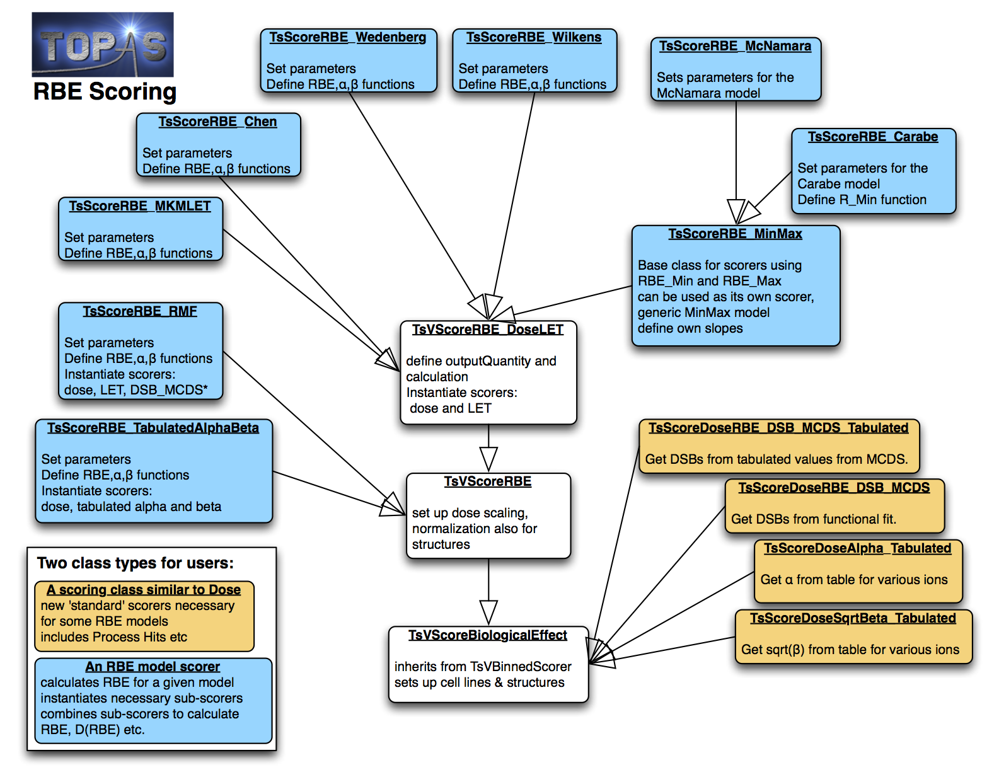

Proton RBE Scorers
==================

TOPAS has included RBE scorers for several RBE models. The implementation follows in principle the methods described in [Polster2015]_.  The models can be separated into two categories, scorers that depend on dose, LET and alpha/beta ratios, and scorers that are not directly a function of LET. For a detailed description of each model please refer to the references provided.

The following models have been implemented for proton RBE calculations:

LET-based scorers:

1.	Carabe [Carabe2012]_; [Carabe2007]_
2.	Chen  [Chen2012]_
3.	McNamara [McNamara2015]_
4.	Microdosimetric Kinetic Model (MKM), LET based version [Hawkins1998]_; [Kase2007]_
5.	Min-Max Model (a generic class, including McNamara and Carabe models)
6.	Wedenberg [Wedenberg2013]_
7.	Wilkens [Wilkens2004]_

Non-LET based scorers

8.	Monte Carlo Damage Simulation (MCDS) for DSB Induction [Semenenko2004]_; [Semenenko2006]_; [Stewart2011]_; [Stewart2015]_
9.	Repair Misrepair Fixation (RMF) [Carlson2008]_; [Frese2012]_
10.	Tabulated RBE tables (e.g. using the PIDE data base) [Friedrich2012]_

The basic concept behind the RBE scorers is to first calculate separately the dose and LET or other relevant quantities, and then, after the simulation is complete, to call the function ``CombineSubScorers`` to combine these separate quantities on a voxel by voxel bases to calculate one of the following quantities:

- RBE  (“rbe”)
- Alpha  (“alpha”)
- Beta  (“beta”)
- Survival fraction (“survivalfraction” or “SF”)
- RBE x Dose  (“rbe_x_dose” or “RWD”, short for RBE weighted dose)

The desired quantity is requested by specifying the OutputQuantity parameter, for example::

	s:Sc/MyScorer/OutputQuantity = "RBE"

using the options indicated in brackets above (case insensitive).

Important notes
~~~~~~~~~~~~~~~

1. RBE-related calculations have to consider the entire radiation field. For single field irradiations, the RBE scorers provided here can be used to directly calculate RBE. However, for patient simulations that try to estimate RBE for multiple field treatments, one has to consider the total dose each voxel receives to obtain the correct RBE. Thus one would have to follow a dose-averaged summation of alpha and beta (see also the description in [Polster2015]_).
2. For most LET-based scorers, it may be easier to simply score dose and LET, sum the dose and LET distributions across fields in a post-processing step, and then calculate RBE or RBE-weighted dose. TOPAS currently only provides an LET scorer for protons (:ref:`scoring_let`).
3. Proton LET only considers energy depositions from protons and secondary electrons. Non-LET based models can also include contributions from other secondaries (Z>1) and can be used for other ion irradiation modalities. This may also result in differences in RBE for some scenarios.

Normalizing simulations to prescriptions
~~~~~~~~~~~~~~~~~~~~~~~~~~~~~~~~~~~~~~~~

Since the simulated number of histories is typically much smaller than the number of protons delivered, it is important to correctly normalize accumulated quantities (e.g. dose, fluence) to the prescribed dose, before using them to compute the RBE. We provide two normalization schemes which are appropriate for different types of simulation.

1. 	Simultaneous Exposure (default). This is appropriate for patient simulations, where the scorer bins measure RBE for a single irradiation. That is, a single beam passes through the scoring volume, and the RBE found in each bin is reported. In this case, the accumulated quantities are normalized by a scaling factor, whose numerator (i.e. the delivered dose) is set by the ``PrescribedDose`` parameter (e.g. ``Sc/MyScorer/PrescribedDose = 60 Gy``) and whose denominator (i.e. the simulated dose) is chosen by the ``PrescribedDoseMetric`` and ``PrescribedDoseStructure`` parameters. The ``PrescribedDoseMetric`` can be chosen from "Max" (default), "Mean" and "D90". The ``PrescribedDoseStructure`` parameter identifies an RTSTRUCT structure (e.g. "CTV") for which the ``PrescribedDoseMetric`` is calculated. If ``PrescribedDoseStructure`` is not set, then the metric is evaluated for the entire scoring volume.

	Note that, to use RTStructures in an RBE scorer, it is currently necessary to include the RTStructure in the ``Ge/Patient/ColorByRTStructNames`` parameter. Also, RTStructures can only be used when scoring RBE upon the CT grid (i.e. the scorer Component is a TsDicomPatient, not a TsBox).

2. 	Repeat exposures (chosen with ``Sc/MyScorer/SimultaneousExposure = "False"``). This is appropriate for simulations of cell experiments, where each scorer bin measures RBE for a separate irradiation. That is, cell experiments are repeated in each scoring bin (e.g. depth) using the same prescribed dose (e.g. 2 Gy). TOPAS can simulate all these experiments in a single run, by normalizing accumulated quantities appropriately. In this case, the prescribed dose delivered to each scorer bin is set by the ``PrescribedDose`` parameter (e.g. ``Sc/MyScorer/PrescribedDose = 2 Gy``).

Using tissue-specific RBE model parameters
~~~~~~~~~~~~~~~~~~~~~~~~~~~~~~~~~~~~~~~~~~

When performing patient simulations, it is useful to ascribe different RBE model parameters to different tissues. For example, it is well known that the tumor can have a dramatically different alpha/beta ratio to the surrounding normal tissue. TOPAS supports this feature by enabling the user to assign cell lines (e.g. ``Sc/CellLineV79``) to structures in the RTSTRUCT DICOM file. When scoring RBE in a specific voxel, the RBE model parameters are then retrieved from the corresponding cell line.

This is specified using the following parameters::

	sv:Sc/MyScorer/RTStructures = 2 "CTV" "Brain"
	sv:Sc/MyScorer/CellLines = 3 "Tumor" "BrainTissue" "OtherTissue"

The order of ``RTStructures`` is important because earlier structures take precedence over structures listed later (e.g. if a voxel is in CTV and Brain, then it uses model parameters for CTV). The number of strings in ``CellLines`` (which is used to lookup model parameters) is one greater than the number of structures. This allows a default CellLine to be defined (at the end). If no structures are listed (i.e. ``RTStructures`` parameter not defined), then ``CellLines`` has only one string, which defines the model parameters to use everywhere.

Note that, to use ``RTStructures`` in an RBE scorer, it is currently necessary to include the RTStructure in the ``Ge/Patient/ColorByRTStructNames`` parameter. Also, RTStructures can only be used when scoring RBE upon the CT grid (i.e. the scorer Component is a TsDicomPatient, not a TsBox).

Reusing sub-scorers to reduce simulation memory requirements
~~~~~~~~~~~~~~~~~~~~~~~~~~~~~~~~~~~~~~~~~~~~~~~~~~~~~~~~~~~~

Each RBE scorer creates an additional scoring grid for each variable that is being used (known as sub-scorers). For example, the McNamara RBE scorer creates dose and LET sub-scorers. This significantly increases the memory footprint of the simulation. In particular, if one wants to use multiple RBE scorers, each has their own sub-scorers, which can result in huge requirements in RAM and CPU time. To avoid duplicating sub-scorers unnecessarily, we added the option for scorers to share sub-scorers, for example, when a dose scorer is already defined, let’s say it’s called "PhysDose", and an LET scorer called "ProtonLET", then multiple RBE scorers can use these scorers by defining::

	s:Sc/McNamara/ReferencedSubScorer_Dose   = "PhysDose"
	s:Sc/McNamara/ReferencedSubScorer_LET    = "ProtonLET"

Content
~~~~~~~

The RBE scorers are contained in a folder that includes an example folder.
The directory consists of the following file types:

Scorers:

-	TsScoreDose* : These score quantities in the ProcessHits function like normal scorers.
-	RBE Scorers: These do not have a ProcessHits function and instead combine scored properties (dose, LET, etc) to RBE or biological dose, etc.
-	TsV*: Base classes for the scorers

A schematic view of the class hierarchy is shown below.

Additionally, the example directory contains an example experiment irradiation (experiment.txt) scoring each of the available RBE scorers (rbe_scorers.txt) for V79 cells (CellLineV79.txt). V79 cells are used because they are one of the most studied cells and biological parameters for all models were available.

The simulations can be run with ``topas run.txt`` and analyzed with the provided python script.

In order to change the experimental setup, edit experiment.txt.

In order to change the cell line, provide a new cell line file and change the following line in run.txt::

	sv:Sc/CellLines     = 1 "CellLineV79"

run.txt also controls the ``PrescribedDose`` used to calculate RBE and the ``OutputQuantity``. The output quantities available depend on the RBE model.

RBE scorers are defined in rbe_scorers.txt and can be edited there. Typically, we recommend not to run too many scorers at once as that increases memory use. In particular, the two parameters ``ReferencedSubScorer_Dose`` and ``ReferencedSubScorer_LET`` should be set if a dose and LET scorer already exists, otherwise each RBE scorer will create sub-scorers for all properties it needs, potentially resulting in duplicated scorers.

Scoring
~~~~~~~

A typical scorer for using the RBE model looks like this (from examples/rbe_scorers.txt)::

	s:Sc/McNamara/Quantity                   = "RBE_McNamara"
	s:Sc/McNamara/Component                  = "Sample"
	s:Sc/McNamara/OutputQuantity             = "RBE"
	d:Sc/McNamara/PrescribedDose             = 2 Gy
	sv:Sc/McNamara/CellLines                 = 1 "CellLineV79"
	b:Sc/McNamara/SimultaneousExposure       = "True"
	s:Sc/McNamara/OutputType                 = "csv"
	s:Sc/McNamara/OutputFile                 = "OutputFileName"
	s:Sc/McNamara/IfOutputFileAlreadyExists  = "Overwrite"
	s:Sc/McNamara/ReferencedSubScorer_Dose   = "PhysDose"   # these two scorers need
	s:Sc/McNamara/ReferencedSubScorer_LET    = "ProtonLET"  # to be defined as well.

Each RBE scorer needs a cell line and selected variables to be defined. The file CellLineV79.txt includes all necessary information for all RBE scorers available. The cell lines can easily be changed by changing the CellLines parameter. You must provide the relevant parameters (e.g. alpha/beta ratio) for new cell lines.
Note: We recommend to not use the provided CellLineV79.txt parameter file as it includes parameters for all models. Using a smaller file with only the parameters necessary for your simulations guarantees that you will use the correct values, not duplicate ones available in the sample file.

For a list of parameters necessary for each scorer please refer to the text files. The parameters necessary also depend on the selected OutputQuantity, for example in the Carabe model, to get RBE, one only has to define ``AlphaBetaRatiox``, i.e. the ratio of α/β, as::

	d:Sc/CellLineV79/AlphaBetaRatiox = 1.412 Gy

If the requested output quantity is alpha, one also needs to define::

	d:Sc/CellLineV79/Alphax = 0.0722 /Gy

For beta::

	d:Sc/CellLineV79/Betax = 0.0502 /Gy2

and for the survival fraction all three parameters need to be set. Please refer to the example files and the scorers for details.

References
~~~~~~~~~~

.. [Carabe2012] Carabe, A. et al., 2012. Range uncertainty in proton therapy due to variable biological effectiveness. Physics in Medicine and Biology, 57(5), pp.1159–1172.
.. [Carabe2007] Carabe-Fernandez, A., Dale, R.G. & Jones, B., 2007. The incorporation of the concept of minimum RBE ( RBEmin) into the linear-quadratic model and the potential for improved radiobiological analysis of high-LET treatments. International Journal of Radiation Biology, 83(1), pp.27–39.
.. [Carlson2008] Carlson, D.J. et al., 2008. Combined use of Monte Carlo DNA damage simulations and deterministic repair models to examine putative mechanisms of cell killing. Radiation Research, 169(4), pp.447–459.
.. [Chen2012] Chen, Y. & Ahmad, S., 2012. Empirical model estimation of relative biological effectiveness for proton beam therapy. Radiat.\ Prot.\ Dosim., 149(2), pp.116–123.
.. [Frese2012] Frese, M.C. et al., 2012. A Mechanism-Based Approach to Predict the Relative Biological Effectiveness of Protons and Carbon Ions in Radiation Therapy. Int J Radiat Oncol, 83(1), pp.442–450.
.. [Friedrich2012] Friedrich, T. et al., 2012. Systematic analysis of RBE and related quantities using a database of cell survival experiments with ion beam irradiation. Journal of Radiation Research, 54(3), pp.rrs114–514.
.. [Hawkins1998] Hawkins, R.B., 1998. A microdosimetric-kinetic theory of the dependence of the RBE for cell death on LET. Medical Physics, 25(7), pp.1157–1170.
.. [Kase2007] Kase, Y. et al., 2007. Biophysical calculation of cell survival probabilities using amorphous track structure models for heavy-ion irradiation. Physics in Medicine and Biology, 53(1), pp.37–59.
.. [McNamara2015] McNamara, A.L., Schuemann, J. & Paganetti, H., 2015. A phenomenological relative biological effectiveness (RBE) model for proton therapy based on all published in vitro cell survival data. Physics in Medicine and Biology, 60(21), pp.8399–8416.
.. [Polster2015] Polster, L. et al., 2015. Extension of TOPAS for the simulation of proton radiation effects considering molecular and cellular endpoints. Physics in Medicine and Biology, 60(13), pp.5053–5070.
.. [Semenenko2004] Semenenko, V.A. & Stewart, R.D., 2004. A fast Monte Carlo algorithm to simulate the spectrum of DNA damages formed by ionizing radiation. Radiation Research, 161(4), pp.451–457.
.. [Semenenko2006] Semenenko, V.A. & Stewart, R.D., 2006. Fast Monte Carlo simulation of DNA damage formed by electrons and light ions. Physics in Medicine and Biology, 51(7), pp.1693–1706.
.. [Stewart2011] Stewart, R.D. et al., 2011. Effects of Radiation Quality and Oxygen on Clustered DNA Lesions and Cell Death. Radiation Research, 176(5), pp.587–602.
.. [Stewart2015] Stewart, R.D. et al., 2015. Rapid MCNP simulation of DNA double strand break (DSB) relative biological effectiveness (RBE) for photons, neutrons, and light ions. Physics in Medicine and Biology, 60(21), pp.8249–8274.
.. [Wedenberg2013] Wedenberg, M., Lind, B.K. & Hårdemark, B., 2013. A model for the relative biological effectiveness of protons: the tissue specific parameter α/β of photons is a predictor for the sensitivity to LET changes. Acta Oncologica, 52(3), pp.580–588.
.. [Wilkens2004] Wilkens, J.J. & Oelfke, U., 2004. A phenomenological model for the relative biological effectiveness in therapeutic proton beams. Physics in Medicine and Biology, 49(13), pp.2811–2825.
