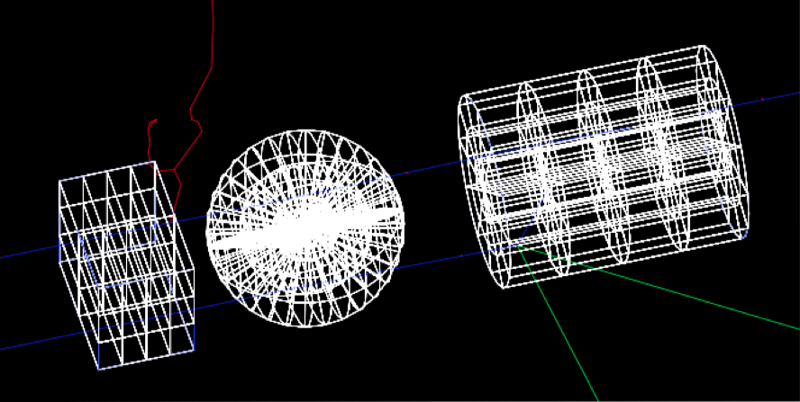

.. _geometry_dividable:

Dividable Components
--------------------

==========  ====================================================================
TsBox       Box that can optionally have divisions, XBins, YBins, ZBins
TsCylinder  Cylinder that can optionally have divisions, RBins, PhiBins, ZBins
TsSphere    Sphere that can optionally have divisions, RBins, PhiBins, ThetaBins
==========  ====================================================================

Scorers associated with the dividable components may use the same or different divisions (thus one can do things like represent the patient with CT resolution but score with other resolutions). See scoring for details.

You can not place child components inside a divided component, but if the only reason for dividing this component is to have fine-grained scoring, you can easily work around this limitation. Use an undivided parent component. Place the children into this undivided parent component. Then when you specify that you want to score on this parent component, specify divided scoring (see the XBins, YBins and ZBins options in scoring). TOPAS will automatically create a parallel world version of your component to handle the divided scoring.

You can optionally specify different materials for each voxel, overriding the value set in the regular ``Ge/Material`` parameter::

    sv:Ge/Phantom/VoxelMaterials = 100 "G4_WATER" "G4_WATER" "Air" "Air" "G4_WATER" ...

This means you can create complex phantoms directly from the parameter system.
VoxelMaterials works for all three kinds of divided components: TsBox, TsCylinder and TsSphere. See the :ref:`example_scoring_voxelmaterials` example.
