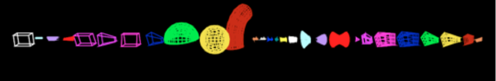

.. _geometry_generic:

Generic Components
------------------

You can create a Geometry Component for any of the standard solids defined in the geometry section of the `Geant4 Application Developers Guide <http://geant4-userdoc.web.cern.ch/geant4-userdoc/UsersGuides/ForApplicationDeveloper/html/Detector/Geometry/geometry.html>`_.

The :ref:`example_basic_shapesall` example demonstrates how to build each of the solids.

Below we list the parameters for each Geant4 solid.
Further details about the parameters, along with helpful diagrams, can be found in the `Geant4 Application Developers Guide <http://geant4-userdoc.web.cern.ch/geant4-userdoc/UsersGuides/ForApplicationDeveloper/html/Detector/Geometry/geomSolids.html>`_.
For most solids, sizes are specified in Half Lengths, denoted with an HL, such as HLX.
For a few solids, sizes are specified in full Lengths, denoted with just L, such as LX.

.. note::

    The TsBox, TsCylinder and TsSphere should be used instead of G4Box, G4Tubs and G4Sphere respectively. See :ref:`geometry_dividable`.

Some examples of components that can be built just from Generic Components:

* Scatterer
* Collimator
* Mirror
* Water Tank
* Rando Phantom (as constructive solid geometry rather than DICOM import)
* Pin Diode Chamber
* Flat Panel Imaging Device
* Standard Ion Chamber
* Segmented Ion Chamber
* Faraday Cup

We have built some complex things just from combinations of the Generic Components (such as the STAR radiosurgery beamline at MGH).

================    =============   =========   ==============
Type                Parameters      Type        Default value
================    =============   =========   ==============
G4CutTubs           | RMin          | d         | 0 cm
                    | RMax          | d         |
                    | HL            | d         |
                    | SPhi          | d         | 0 deg
                    | DPhi          | d         | 360 deg
                    | LowNorm       | uv (3)    |
                    | HighNorm      | uv (3)    |
G4Cons              | RMin1         | d         | 0 cm
                    | RMax1         | d         |
                    | RMin2         | d         | 0 cm
                    | RMax2         | d         |
                    | HL            | d         |
                    | SPhi          | d         | 0 deg
                    | DPhi          | d         | 360 deg
G4Para              | HLX           | d
                    | HLY           | d
                    | HLZ           | d
                    | Alpha         | d
                    | Theta         | d
                    | Phi           | d
G4Trd               | HLX1          | d
                    | HLX2          | d
                    | HLY1          | d
                    | HLY2          | d
                    | HLZ           | d
G4RTrap             | LZ            | d
                    | LY            | d
                    | LX            | d
                    | LTX           | d
G4GTrap             | HLZ           | d
                    | Theta         | d
                    | Phi           | d
                    | HLY1          | d
                    | HLX1          | d
                    | HLX2          | d
                    | Alp1          | d
                    | HLY2          | d
                    | HLX3          | d
                    | HLX4          | d
                    | Alp2          | d
G4Orb               | R             | d
G4Torus             | RMin          | d         | 0 cm
                    | RMax          | d         |
                    | RTor          | d         |
                    | SPhi          | d         | 0 deg
                    | DPhi          | d         | 360 deg
G4HPolycone         | PhiStart      | d
                    | PhiTotal      | d
                    | Z             | dv (N)
                    | RInner        | dv (N)
                    | ROuter        | dv (N)
G4SPolycone         | PhiStart      | d         | 0 deg
                    | PhiTotal      | d         | 360 deg
                    | R             | dv (N)    |
                    | Z             | dv (N)    |
G4GenericPolycon    | PhiStart      | d         | 0 deg
                    | PhiTotal      | d         | 360 deg
                    | R             | dv (N)    |
                    | Z             | dv (N)    |
G4HPolyhedra        | PhiSTart      | d         | 0 deg
                    | PhiTotal      | d         | 360 deg
                    | NSides        | i         |
                    | Z             | dv (N)    |
                    | RInner        | dv (N)    |
                    | ROuter        | dv (N)    |
G4SPolyhedra        | PhiSTart      | d         | 0 deg
                    | PhiTotal      | d         | 360 deg
                    | NSides        | i         |
                    | R             | dv (N)    |
                    | Z             | dv (N)    |
G4EllipticalTube    | HLX           | d
                    | HLY           | d
                    | HLZ           | d
G4Ellipsoid         | HLX           | d         |
                    | HLY           | d         |
                    | HLZ           | d         |
                    | ZBottom       | d         | -HLZ cm
                    | ZTop          | d         | +HLZ cm
G4EllipticalCone    | HLX           | d         |
                    | HLY           | d         |
                    | ZMax          | d         |
                    | ZTop          | d         | ZMax cm
G4Paraboloid        | HLZ           | d
                    | R1            | d
                    | R2            | d
G4Hype              | IR            | d         | 0 cm
                    | OR            | d         |
                    | IS            | d         | 0 deg
                    | OS            | d         |
                    | HLZ           | d         |
G4Tet               | Anchor        | dv (3)
                    | P2            | dv (3)
                    | P3            | dv (3)
                    | P4            | dv (3)
G4Extruded          | Polygons      | dv (2N)
                    | HLZ           | d
                    | Off1          | dv (2)
                    | Scale1        | uv (2)
                    | Off2          | dv (2)
                    | Scale2        | uv (2)
G4TwistedBox        | Twist         | d
                    | HLX           | d
                    | HLY           | d
                    | HLZ           | d
G4RTwistedTrap      | Twist         | d
                    | HLX1          | d
                    | HLX2          | d
                    | HLY           | d
                    | HLZ           | d
G4GTwistedTrap      | Twist         | d
                    | HLZ           | d
                    | Theta         | d
                    | Phi           | d
                    | HLY1          | d
                    | HLX1          | d
                    | HLX2          | d
                    | HLY2          | d
                    | HLX3          | d
                    | HLX4          | d
                    | Alpha         | d
G4TwistedTrd        | HLX1          | d
                    | HLX2          | d
                    | HLY1          | d
                    | HLY2          | d
                    | HLZ           | d
                    | Twist         | d
G4GenericTrap       | HLZ           | d
                    | Vertices      | dv (2N)
G4TwistedTubs       | Twist         | d
                    | EndInnerRad   | d
                    | EndOuterRad   | d
                    | HLZ           | d
                    | Phi           | d
================    =============   =========   ==============
