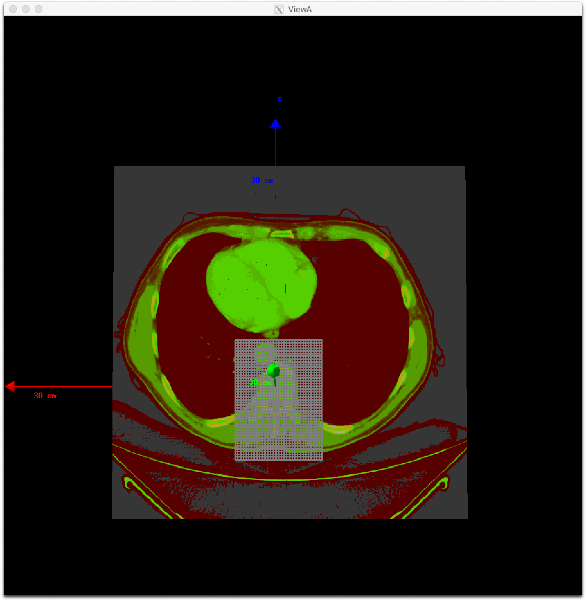
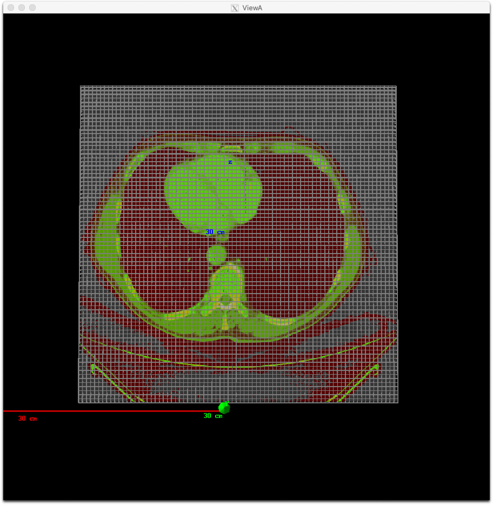

Patient Components
------------------

TOPAS currently supports the following Patient Component types:

=================================  ========================
Geometry Component                 Type
=================================  ========================
:ref:`geometry_patient_dicom`      TsDicomPatient
:ref:`geometry_patient_imagecube`  TsImageCube (handles XCAT, XiO and more)
=================================  ========================

It is also necessary to define how to convert the imaging data to material data, following a :ref:`imaging_material_conversion` scheme.

.. _geometry_patient_common:

Common Parameters
~~~~~~~~~~~~~~~~~

Many of the parameters for Patient Components are common to both TsDicomPatient and TsImageCube. These are described here.

To perform Monte Carlo simulation, TOPAS needs to map each voxel of the patient image to a material, density and, for useful graphics, a color.
You specify how to do this by telling TOPAS which :ref:`imaging_material_conversion` to use.

To dump your file's raw imaging values to the console::

    b:Ge/Patient/DumpImagingValues = "True"

Set any parent you like, but it is often convenient to place patient into a group component which can then be rotated to represent couch setup::

    s:Ge/Patient/Parent = "PatientGroup"

Even though a large number of materials are defined in your HU conversion file, TOPAS will only create those materials that are actually used in your CT image.
In the 4DCT case, if any image introduces new materials that were not in the first image, Geant4 will be unable to proceed (it cannot load new materials after physics has initialized). TOPAS will exit with a warning message advising you to set the parameter::

    b:Ge/Patient/PreLoadAllMaterials = "True"

Startup will then be slower, since TOPAS will preload the full set of materials defined in your HU conversion file, but your 4DCT will then work.

For single slice thickness images, scoring will use the same voxel divisions as your CT image.
For multiple slice thicknesses, scoring will not know what divisions to use unless you explicitly specify these in your scoring parameters, such as::

    i:Sc/MyScorer/XBins = 512
    i:Sc/MyScorer/YBins = 512
    i:Sc/MyScorer/ZBins = 256

The built-in Geant4 visualization tools do not perform well when a complex voxel structure is loaded. To make visualization more successful, several additional parameters are provided.

There is generally little value in showing all pixels of the image at once. Each slice just covers up the last slice. To instead show only a specific set of slices in any dimension::

    iv:Gr/Patient/ShowSpecificSlicesZ = 4 1 3 9 12 # will only show slices 1, 3, 9 and 12.

Number of slices begins at number 1.

Similar slicing is allowed in X and Y.
Three special values are also allowed::

    iv:Gr/Patient/ShowSpecificSlicesZ = 1 0 # means show all slices
    iv:Gr/Patient/ShowSpecificSlicesZ = 1 -1 # means only show center slice
    iv:Gr/Patient/ShowSpecificSlicesZ = 1 -2 # means only first, center and last slice

The following will result in a display that shows 27 pixels comprising the boundaries and center of the image. This allows you to see the overall placement of the image and see the individual voxel size::

    iv:Gr/Patient/ShowSpecificSlicesX = 1 -2 # means only show center slice
    iv:Gr/Patient/ShowSpecificSlicesY = 1 -2 # means only show center slice
    iv:Gr/Patient/ShowSpecificSlicesZ = 1 -2 # means only show center slice

You have the Option to Load a Truncated DICOM, XiO or ImageCube.
Parameters to restrict which voxels of a patient image are loaded are:

    i:Ge/*/RestrictVoxelsXMin
    i:Ge/*/RestrictVoxelsYMin
    i:Ge/*/RestrictVoxelsZMin
    i:Ge/*/RestrictVoxelsXMax
    i:Ge/*/RestrictVoxelsYMax
    i:Ge/*/RestrictVoxelsZMax

The previously mentioned parameters, ShowSpecificSlicesVoxels, affect only the graphical output of the voxels.
The voxels were still all loaded, and all affected the physics results, but only specific voxels were shown in graphics.

The RestrictVoxels... parameters have a much more significant effect: they cause TOPAS to not even load some parts of the patient.
This can save a lot of time and allow you to test things on DICOM or other image formats quickly,
as you only have to load whatever part of the DICOM you actually want to use.
Beware though: if you use this option, you will change your results.
It is not just a graphics thing. It actually avoids creating the given voxels at all.

Though our main motivation for this work was to get a way to do more rapid development
(testing on real patients without the slowdown of loading everything), there may be a value also for
our brachytherapy users. They may only need to load the part of the image that is near the brachy source.

Another option allows you to specify the maximum number of voxels to show. If the total number of voxels is greater than this limit, TOPAS will just draw the overall DICOM outline::

    i:Gr/ShowOnlyOutlineIfVoxelCountExceeds = 8000

.. _geometry_patient_dicom:

Patient in DICOM Format
~~~~~~~~~~~~~~~~~~~~~~~

DICOM import is handled through the `GDCM <http://gdcm.sourceforge.net>`_ package, which is pre-built into TOPAS.

See the :ref:`example_dicom` and :ref:`example_dicom_time` examples of how to use TsDicomPatient. Note that before running this example, you must unzip the included DICOM files.

You specify the name of a directory containing one or more dcm files (one for each slice)::

    s:Ge/Patient/DicomDirectory = "DICOM_Box"

To specify 4DCT, you can have DicomDirectory change under control of a :ref:`Time Feature <time_feature>`.

Files of other types in this directory will be ignored.
Exact titles of the dcm files are not important as TOPAS will re-order them based on the slice ordering information inside the DICOM headers.

By default, Topas will only consider dcm files that are from CT. This can be adjusted by::

    sv:Ge/Patient/DicomModalityTags = 1 "CT" # defaults to just CT

Other modality tags are, for example, ``"MR"`` for Magnetic Resonance and ``"US"`` for Ultrasound. A complete list can be found `here <https://wiki.cancerimagingarchive.net/display/Public/DICOM+Modality+Abbreviations>`_.

Patient positioning information from the DICOM file is not currently used. You must position as you would for any TOPAS component::

    d:Ge/Patient/TransX=0. m
    d:Ge/Patient/TransY=0. m
    d:Ge/Patient/TransZ=0. m
    d:Ge/Patient/RotX=0. deg
    d:Ge/Patient/RotY=0. deg
    d:Ge/Patient/RotZ=0. deg

TOPAS can read DICOM RT Structure Sets.
A structure set is an extra file in the DICOM directory that provides information on structures such as organs, tumors, PTVs, etc. that have been outlined (contoured) in the planning process. The data is stored as a set of polygons, up to one per slice for each contoured structure. TOPAS can color code DICOM components according to this structure information and can filter scoring based on these structures (see the filter: OnlyIncludeIfInRTStructure).

.. todo:: DICOM RTSTRUCT actually supports multiple polygons per structure per slice

To make TOPAS color the voxels by structure::

    sv:Ge/Patient/ColorByRTStructNames = 2 "R_LUNG" "L_LUNG"
    sv:Ge/Patient/ColorByRTStructColors = 2 "yellow" "red"

* If the structure name includes a space, substitute an underscore in the parameter. So, for example, if the structure name is "R LUNG", you should supply the parameter as "R_LUNG".
* If you don’t actually know what structures are included in your DICOM, just try providing in ``ColorByRTStructNames``. TOPAS will give you an error message that includes a list of the known structure names.
* To allow easy testing of this feature in simple DICOM examples that don’t really have any structures, the following parameter will "fake" an RT structure set, assigning the given structure to all voxels in the lower XY quadrant::

    b:Ge/Patient/FakeStructures = "True"

TOPAS can automatically set DicomOrigin parameters to help with patient positioning.

If you define a set of DicomOrigin parameters for your patient::

    dc:Ge/Patient/DicomOriginX = 0.0 mm
    dc:Ge/Patient/DicomOriginY = 0.0 mm
    dc:Ge/Patient/DicomOriginZ = 0.0 mm

then when you read in a TsDicomPatient, TOPAS will update these parameters on the fly to provide the origin of the DICOM coordinate system specified in the TOPAS coordinate system.

You can combine this information with other information you may have about your isocenter to get your patient properly positioned.
For example, if you just wanted to center your patient in its parent component, such as PatientGroup, you would do::

    s:Ge/Patient/Type     = "TsDicomPatient"
    s:Ge/Patient/Parent   = "PatientGroup"
    d:Ge/Patient/TransX   = 0.0 mm
    d:Ge/Patient/TransY   = 0.0 mm
    d:Ge/Patient/TransZ   = 0.0 mm

If you also had isocenter information from at RT-Ion plan in DICOM coordinates::

    d:Rt/plan/IsoCenterX = 0.0      mm
    d:Rt/plan/IsoCenterY = -99.9904 mm
    d:Rt/plan/IsoCenterZ = -14.0    mm

you could adjust the patient to isocenter by doing::

    d:Ge/Patient/TransX = Ge/Patient/DicomOriginX - Rt/plan/IsoCenterX mm
    d:Ge/Patient/TransY = Ge/Patient/DicomOriginY - Rt/plan/IsoCenterY mm
    d:Ge/Patient/TransZ = Ge/Patient/DicomOriginZ - Rt/plan/IsoCenterZ mm

See :ref:`example_dicom_viewabdomen_rtdose` for an example of how to use these patient-positioning features.

TOPAS can automatically create a Scoring Grid that exactly matches a provided RTDOSE file in your DICOM dataset.
This makes it easier to compare TOPAS results to Treatment Planning System results.

Tell TOPAS which RTDOSE file to use by providing "CloneRTDoseGridFrom" parameter, such as::

    s:Ge/Patient/CloneRTDoseGridFrom = Ge/Patient/DicomDirectory + "/RTDOSE.dcm"

You can adjust pixel sizes while keeping the position, such as::

    s:Ge/Patient/CloneRTDoseGridFrom = Ge/Patient/DicomDirectory + "/rtdose.dcm"
    dv:Ge/Patient/CloneRTDoseGridSize = 3 5 5 8 mm

In addition, you can define a dose grid without a RTDOSE file by specifying its grid size such as::

    dv:Ge/Patient/CloneRTDoseGridSize = 3 5 5 5 mm

A dose grid that fits the volume of a TsDicomPatient will be created.

TOPAS will then automatically create a scoring volume in a parallel world to overlay your grid,
and will name this component with the same name as your patient, plus "/RTDoseGrid".
You can then score on this component just like on any other component::

    s:Sc/Dose/Component = "Patient/RTDoseGrid"

TOPAS Scoring can use information from your DICOM dataset so that scored results can be more easily compared to those from treatment planning systems, by using a consistent coordinate system. See :ref:`scoring_output_dicom` for more information.

.. _geometry_patient_imagecube:

Patient in ImageCube Format (handles XCAT, XiO, MaterialTagNumber and more)
~~~~~~~~~~~~~~~~~~~~~~~~~~~~~~~~~~~~~~~~~~~~~~~~~~~~~~~~

We refer to a patient input file as an "Image Cube" if it is a simple binary file that contains one value for each voxel.
These values may be Housefield units or any other sort of imaging information that you have. Elsewhere you will tell TOPAS how to convert a given value from this file into a specfic material for that voxel.

- For the case of an XCAT phantom, the binary file will contain, for each voxel, an activation or attenuation value as a float
- For the case of an XiO patient, the binary file will contain, for each voxel, a Hounsfield value as a short
- For the case of a MaterialTagNumber file, the binary file will contain, for each voxel, a material index as a short
- For other cases, you can provide a binary file that contains, for each voxel, any float, int or short

 (and for XCAT phantoms, there may be an additional file, an XCAT log, that provides metadata)

An ImagingToMaterialConverter, described in the next section, handles the details of how each voxel's information is converted to a material specification.

See the :ref:`example_xcat` example of how to read an XCAT file.
See the :ref:`example_dicom` example of how to read an XiO file.

Specify file directory and file name::

    s:Ge/Patient/InputDirectory = "./"
    s:Ge/Patient/InputFile = "ctvolume.dat" # match exact case

To specify 4DCT, you can have ``InputDirectory`` or ``InputFile`` change under control of a :ref:`Time Feature <time_feature>`.

For 4D CT, a parameter lets you decide whether the material maps for the
various CT phases will be cached (saving time if they are reused again)
or not (saving memory):

    b:Ge/CacheMaterialMapForEachTimeSlice defaults to True

You must position as you would for any TOPAS component::

    d:Ge/Patient/RotX = 0. deg
    d:Ge/Patient/RotY = 90. deg
    d:Ge/Patient/RotZ = 0. deg
    d:Ge/Patient/TransX = 1.5 mm
    d:Ge/Patient/TransY = 3.3 mm
    d:Ge/Patient/TransZ = 4.2 mm

TOPAS then needs some metadata: specifically it needs to know:

- how many voxels there are in each dimension
- how large the voxels are in each dimension
- what data type is involved (float, int or short)
- how to convert the given value to a material

For XCAT phantoms, all of this metadata can come from an XCAT log file::

    s:Ge/Patient/MetaDataFile = "XCAT_FullMouse_86x86x161_atn_1.log"

If you had some other form of Image Cube (not XCAT), or you don't want to read this information from an XCAT log file,
you can provide this meta data as TOPAS parameters::

    s:Ge/Patient/DataType  = “FLOAT” # “SHORT”, “INT” or “FLOAT"
    i:Ge/Patient/NumberOfVoxelsX  = 86
    i:Ge/Patient/NumberOfVoxelsY  = 86
    i:Ge/Patient/NumberOfVoxelsZ = 161
    d:Ge/Patient/VoxelSizeX       = .5 mm
    d:Ge/Patient/VoxelSizeY       = .5 mm
    d:Ge/Patient/VoxelSizeZ       = .5 mm

If there are multiple slice thicknesses in your image, use vectors to specify number and thickness of voxels in each section. For example, a 30 slice image that has 10 slices of 2.5 mm and then 20 slices of 1.25 mm::

    iv:Ge/Patient/NumberOfVoxelsZ = 2 10 20
    dv:Ge/Patient/VoxelSizeZ = 2 2.5 1.25 mm

If you are using XCAT without providing metadata from an XCAT log file, you should also provide parameters to tell TOPAS what material to use for a given value found in the XCAT binary file, such as::

    u:Ge/Patient/AttenuationForMaterial_XCAT_Air    =   0.
    u:Ge/Patient/AttenuationForMaterial_XCAT_Muscle = 195.2515
    u:Ge/Patient/AttenuationForMaterial_XCAT_Lung   =  57.5347

.. _imaging_material_conversion:

Imaging to Material Conversion
~~~~~~~~~~~~~~~~~~~~~~~~~~~~~~

You are free to write your own converter, including approaches that use alternative imaging modalities (e.g. MRI, pCT, ultrasound), or that use more than one image (e.g. Dual Energy CT, Multi-Energy CT). To write your own converter, see :ref:`extension_imaging_material_conversion`.

XCAT
~~~~

TOPAS provides two built-in converters for XCAT and other Image Cube data::

    s:Ge/Patient/ImagingToMaterialConverter = "XCAT_Attenuation" # "XCAT_Activity"

These converters assume the value found in the binary file for a given voxel is either an Attenuation or an Activity.
They then convert the given value to a material name from either the metadata file (the XCAT log file) or from explicit parameters you have specified such as::

    u:Ge/Patient/AttenuationForMaterial_XCAT_Air    =   0.
    u:Ge/Patient/AttenuationForMaterial_XCAT_Muscle = 195.2515
    u:Ge/Patient/AttenuationForMaterial_XCAT_Lung   =  57.5347

The actual material name that TOPAS will expect you to define somewhere is the part after ``"AttenuationForMaterial_"``, such as XCAT_Air and XCAT_Muscle. You need to make sure that these material names have been defined somewhere in your TOPAS parameters. In our XCAT example we defined these in the file XCAT_Materials.txt. Two notes on this example XCAT_Materials file:

- We faked the definitions, defining all the materials as different colors of what is really just water. You could edit this file to provide the real elemental compositions of the various materials.
- We only defined the materials used in the attenuation part of the XCAT log file. If you instead want to use the materials used in the activity part of the XCAT log file, you’ll need to define some additional materials (the activity part of that XCAT log file had more materials than the attenuation part).

MaterialTagNumber
~~~~~~~~~~~~~~~~~

Some of our users have TsImageCube components where each voxel is represented not as a CT number but as an integer "tag number," a 16-bit integer (C++ short) that corresponds to a particular material name. The ImagingToMaterialConverter called MaterialTagNumber will interpret these tag numbers based on a lookup table created by two additional TOPAS vector parameters, MaterialTagNumbers and MaterialNames. For example::

    s:Ge/Patient/Type = "TsImageCube"
    s:Ge/Patient/ImagingToMaterialConverter = "MaterialTagNumber"
    iv:Ge/Patient/MaterialTagNumbers = 6 0 3 42 43 100 110
    sv:Ge/Patient/MaterialNames = 6 "Air" "G4_BLOOD_ICRP" "G4_BONE_CORTICAL_ICRP" "G4_BONE_COMPACT_ICRU" "G4_BRAIN_ICRP" "G4_MUSCLE_SKELETAL_ICRP"

Thus:

* Where the voxel is tagged with the number 0, the converter will interpret this as "Air"
* Where the voxel is tagged with the number 3, the converter will interpret this as " G4_BLOOD_ICRP "
* Where the voxel is tagged with the number 42, the converter will interpret this as " G4_BONE_CORTICAL_ICRP "
* etc.

Schneider
~~~~~~~~~

TOPAS provides a built-in converter that follows the most common method used in proton therapy for DICOM or XiO patient data (`PubMed <http://www.ncbi.nlm.nih.gov/pubmed/10701515>`_):

* Schneider W, Bortfeld T and Schlegel W. Correlation between CT numbers and tissue parameters needed for Monte Carlo simulations of clinical dose distributions. Phys. Med. Biol. 2000; 45(2):459-78.

This converter follows the technique developed by Schneider to assign materials based on a single CT image file containing Hounsfield Unit (HU) values. It is selected using::

    s:Ge/Patient/ImagingtoMaterialConverter = "Schneider"

The HU conversion parameters are typically stored in a separate parameter file::

    includeFile = HUtoMaterialSchneider.txt

An example of such a HU conversion parameter file is examples/DICOM/HUtoMaterialSchneider.txt.

The first set of parameters in the HU file are used to calculate density::

    dv:Ge/Patient/DensityCorrection = 3996 9.35212 5.55269 4.14652 ...1.06255 1.00275 g/cm3
    iv:Ge/Patient/SchneiderHounsfieldUnitSections = 8 -1000 -98 15 23 101 2001 2995 2996
    uv:Ge/Patient/SchneiderDensityOffset = 7 0.00121 1.018 1.03 1.003 1.017 2.201 4.54
    uv:Ge/Patient/SchneiderDensityFactor = 7 0.00103 0.00089 0.0 0.00117 0.00059 0.0005 0.0
    uv:Ge/Patient/SchneiderDensityFactorOffset = 7 1000. 0. 1000. 0. 0. -2000. 0.

``DensityCorrection``:

* One value for every possible HU value.
* Values start from ``Ge/Patient/MinImagingValue`` which defaults to -1000

``SchneiderHounsfieldUnitSections``:

* Specifies how to break up the entire set of HU units into several density calculation sections. The HU conversion formula then uses different correction factors for each of these sections.
* The total range (last value minus first value) must equal the number of values in ``DensityCorrection``.
* In the above example, the 8 values define 7 sections:

    * Section 1: -1000 to -99
    * Section 2: -98 to 14
    * ...
    * Section 7: 2995 to 2996

``SchneiderDensityOffset``, ``SchneiderDensityFactor`` and ``SchneiderDensityFactorOffset``:

* Must have one value for each of the density calculation sections, so length must be one less than the length of ``SchneiderHounsfieldUnitSections``

Thus, for any specific HU number, we can extract the appropriate:

* DensityCorrection
* SchneiderDensityOffset
* SchneiderDensityFactor
* SchneiderDensityFactorOffset

And use these in the Schneider formula:

* Density = ( Offset + ( Factor * ( FactorOffset + HU[-1000,2995] ) ) ) * DensityCorrection

The second set of parameters in the HU file are used to calculate material name and graphics color::

    iv:Ge/Patient/SchneiderHUToMaterialSections = 26 -1000 -950 -120 -83 ... 1500 2995 2996
    sv:Ge/Patient/SchneiderElements = 13 "Hydrogen" "Carbon" "Nitrogen" "Oxygen" ...
    uv:Ge/Patient/SchneiderMaterialsWeight1 = 13 0.0   0.0   0.755 0.232 ...
    uv:Ge/Patient/SchneiderMaterialsWeight2 = 13 0.103 0.105 0.031 0.749 ...
    ...
    iv:Gr/Color/PatientTissue1 = 3  63 63 63
    iv:Gr/Color/PatientTissue2 = 3 100  0  0
    ...

``iv:SchneiderHUToMaterialSections``:

* Specifies how to break up the entire set of HU units into several material name assignment sections.
* The total range (last value minus first value) must equal the number of values in ``DensityCorrection``.
* In the above example, the 26 values define 7 material name assignment sections:

    * Section 1: -1000 to -949
    * Section 2: -50 to -119
    * ...
    * Section 25: 2995 to 2996

``sv:SchneiderElements``:

* Specifies all of the elements that will be used in the patient.
* All patient materials must be composed from combinations of this set of elements.

``uv:SchneiderMaterialsWeight1`` through ``SchneiderMaterialsWeight25``:

* There should be one of these parameters for each of the material name assignment sections. The length of ``SchneiderMaterialsWeight`` must equal the length of ``SchneiderElements``.
* Each value in ``SchneiderMaterialsWeight`` tells what proportion of the given element in ``SchneiderElements`` to use in this material.
* In our ``SchneiderMaterialsWeight2`` parameter, the values: 0.103 0.105 0.031 0.749 mean:

    * 10.3 percent of the first element, Hydrogen
    * 10.5 percent of the second element, Carbon
    * 3.1 percent of the second element, Nitrogen
    * 74.9 percent of the second element, Oxygen

* You may optionally provide this parameter to override the default mean excitation energies of some or all of the materials.
* There should be one value for each material name assignment section.
* To use the default mean excitation energy for a particular material, enter that value as 0.
* For example, the following just overrides defaults for two out of 26 assignment sections::

    dv:Ge/Patient/SchneiderMaterialMeanExcitationEnergy = 26 88.8 0. 77.7. 0. 0. 0. 0. 0.
    0. 0. 0. 0. 0. 0. 0. 0. 0. 0. 0. 0. 0. 0. 0. 0. 0. 0. eV

``iv:Gr/Color/PatientTissue1``:

* Specifies what colors should be assigned to each of the materials.
* There should be one of these parameters for each of the ``SchneiderHUToMaterialSections``.
* The three values specify the Red, Green and Blue components of the color.

Putting it all together, we have now specified density, material name, color and, optionally, mean excitation energy, for each of the Hounsfield numbers in the patient.

You can review the materials definitions that TOPAS created based on your patient file and the HU conversion settings. The following parameter tells TOPAS to dump parameters to a file::

    Ts/DumpNonDefaultParameters = "True"

For each HU number that was used in the patient file, you will see a set of parameters starting with ``Ma/PatientTissueFromHU`` followed by an HU number.
For example, for HU number -295, you may see::

    Ma/PatientTissueFromHU-295/Component = 9 Hydrogen Carbon Nitrogen Oxygen Phosphorus Sulfur Chlorine Sodium Potassium
    Ma/PatientTissueFromHU-295/Fractions = 9 0.103 0.105 0.031 0.749 0.002 0.003 0.003 0.002 0.002
    Ma/PatientTissueFromHU-295/Density = 0.707487 g/cm3
    Ma/PatientTissueFromHU-295/DefaultColor = PatientTissue2

where you then follow the ``DefaultColor`` parameter named ``PatientTissue2`` to see that ``Gr/Color/PatientTissue2`` is ``3 100 0 0`` which means a mixture of 100 percent Red, 0 percent green, 0 percent blue.
