Specialized Components
----------------------

=========================== ========================
Geometry Component          Type
=========================== ========================
:ref:`geometry_rmw`         TsRangeModulator
:ref:`geometry_propeller`   TsPropeller
:ref:`geometry_ridgefilter` TsRidgeFilter
:ref:`geometry_mwc`         TsMultiWireChamber
:ref:`geometry_mlc`         TsMultiLeafCollimator
:ref:`geometry_cad`         TsCAD
:ref:`geometry_aperture`    TsAperture
:ref:`geometry_compensator` TsCompensator
:ref:`geometry_applicator`  TsBrachyApplicator
:ree:`geometry_jaws`        TsJaws
=========================== ========================

Each of the specialized components has its own set of special parameters. Usage is best learned by studying the relevant examples parameter files included in TOPAS.

You may write your own additional components (see :ref:`extension_geometry`).

The following figure from Samsung Medical Center shows how their very specific quadrupole magnet system was coded as a TOPAS geometry.

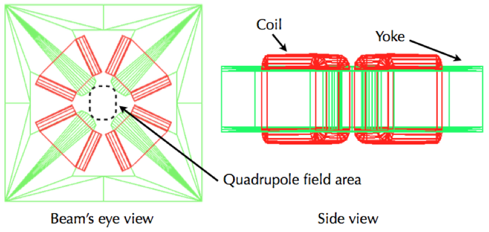

.. _geometry_rmw:

Range Modulator Wheel
~~~~~~~~~~~~~~~~~~~~~

TOPAS Range modulator is designed to accommodate various specifications from a vendor. We suggest modeling your Range Modulator Wheel (RMW) by the following procedure:

* Define the dimension of RMW drum, such as thickness and material of shell and hub (see figure below). Tracks will be placed in between the hub and the shell.
* This space (in between hub and shell) is vertically divided into three sections named, "Upper", "Middle", and "Bottom" so that each section can have its own tracks. You can adjust heights of these sections. The sum of these heights is the total height of your RMW.
* In order to reserve spaces for tracks, divide radially each section into as many as tracks you want by using the parameter, ``RadialDivision``
* Using vector parameters, configure the tracks individually such as each block’s height, span angle, and material. Then assign vector parameter to the parameter, called ``Pattern``

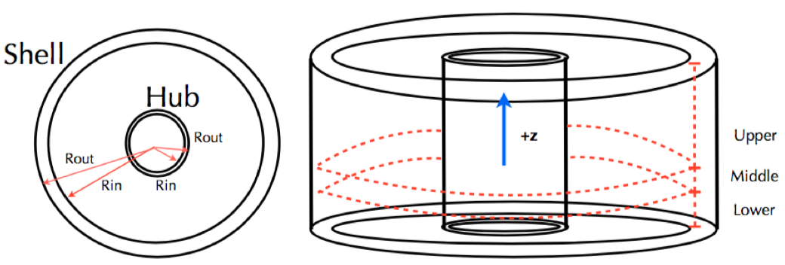

Illustration for TOPAS RMW dimensions. Tracks are placed in between Rout of Hub and Rin of Shell and this area is to be radially divided in case of placing multiple tracks. There are three vertical rooms, so it is possible to make double sided RMWs with an interface disk.

.. image:: RMW_2.png

An example of RMW; (a) Perspective view. Upper section is divided into two but only inner radial division has a track pattern. In middle section, two track patterns are used to make a hole. (b) X-Y view from +z of RMW and (c) X-Y view from -z of RMW. Tracks are drawn in wireframe style, so more lines on the tracks are shown than the number of blocks.

Here is the complete set of the parameters for the above RMW (see :ref:`example_special_rmw` example)::

    # Common parameters: type of geometry, position, and rotation
    s:Ge/RangeModulatorA/Type = "TsRangeModulator"
    s:Ge/RangeModulatorA/Material = "Parent"
    s:Ge/RangeModulatorA/Parent = "World"
    d:Ge/RangeModulatorA/TransX = 10.0 cm
    d:Ge/RangeModulatorA/TransY = 0.0 cm
    d:Ge/RangeModulatorA/TransZ = 0.0 cm
    d:Ge/RangeModulatorA/RotX = 0.0 deg
    d:Ge/RangeModulatorA/RotY = 0.0 deg
    d:Ge/RangeModulatorA/RotZ = 0.0 deg
    b:Ge/RangeModulatorA/Invisible = "TRUE"

    # Set height of each sections and total height = 160.0 mm
    d:Ge/RangeModulatorA/HeightOfUpper = 150 mm
    d:Ge/RangeModulatorA/HeightOfMiddle = 1.0 mm
    d:Ge/RangeModulatorA/HeightOfLower = 9.0 mm

    # Shell dimensions, material, color, etc.
    d:Ge/RangeModulatorA/Shell/Rin = 15.0 cm
    d:Ge/RangeModulatorA/Shell/Rout = 15.5 cm
    s:Ge/RangeModulatorA/Shell/Material = "Aluminum"
    s:Ge/RangeModulatorA/Shell/Color = "grey"
    s:Ge/RangeModulatorA/Shell/DrawingStyle = "Solid"
    i:Ge/RangeModulatorA/Shell/VisSegsPerCircle = 360

    # Hub dimensions, material, color, etc.
    d:Ge/RangeModulatorA/Hub/Rin = 6.0 cm
    d:Ge/RangeModulatorA/Hub/Rout = 7.0 cm
    s:Ge/RangeModulatorA/Hub/Material = "Aluminum"
    s:Ge/RangeModulatorA/Hub/Color = "grey"
    s:Ge/RangeModulatorA/Hub/DrawingStyle = "Solid"
    i:Ge/RangeModulatorA/Hub/VisSegsPerCircle = 360

    # Setting tracks on Upper area
    # Two tracks Track1 (7.0 cm ~ 11.0 cm) and Track2 ( 11.0 cm ~ 15.0 cm)
    dv:Ge/RangeModulatorA/Upper/RadialDivisions=1 11.0 cm

    # Assignment of track pattern of Upper area
    # Track1 refers the pattern named "LexanBlockT1" whose vector parameters are defined elsewhere (see below).
    s:Ge/RangeModulatorA/Upper/Track1/Pattern = "LexanBlockT1"
    s:Ge/RangeModulatorA/Upper/Track2/Pattern = "NULL" #NULL means empty track.

    # Track1 pattern: 14 blocks of Lexan.
    # Numbers of Angles, Heights, and Materials should be same.
    d:Ge/LexanBlockT1/Offset=0.0 deg #means shift of zero-angle
    # Angle divisions. The first block’s spans from 5.0 deg to 115.0 deg.
    # The last block starting at 324.0 deg spans to the first block’s boundary.
    # This case last block spans from 324.0 deg to 360.0 + 5.0 deg
    dv:Ge/LexanBlockT1/Angles=14
    5.00 115.00 146.50 173.2 195.07
    216.15 230.14 243.00 255.5 270.60
    282.20 294.60 306.20 324.00 deg
    # Height of each block.
    # Note that zero height means that no block in that angle range.
    dv:Ge/LexanBlockT1/Heights=14
    77.0 82.0 87.0 92.15 95.0
    100.4 106.0 110.2 115.3 119.5
    124.0 128.8 132.00 60.0 mm

    # Material of each block.
    sv:Ge/LexanBlockT1/Materials=14
    "Lexan" "Lexan" "Lexan" "Lexan" "Lexan"
    "Lexan" "Lexan" "Lexan" "Lexan" "Lexan"
    "Lexan" "Lexan" "Lexan" "Brass"

In the same way, you can configure other tracks.
Then the track1 on upper area looks like following figure.

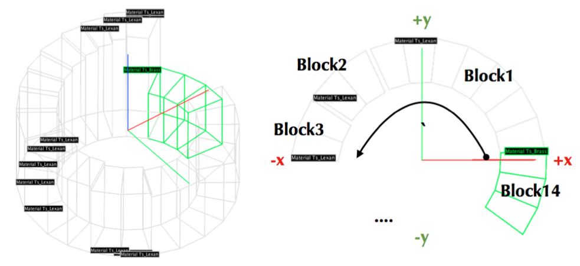

A track pattern from the parameter above; (left) a complete set of the track view. (right) blocks are constructed in counterclockwise.

::

    b:Ge/RangeModulatorA/PrintInformation = "True" #Print out specification, see below

When TOPAS builds the geometry, you will see the numbers are input properly from console output as:

.. code-block:: plain

    ---UpperTrack1 , # of Blocks: 14
    0th Block
      Angle : 5, 115 deg
      Height : 7.7 cm
      Material: Ts_Lexan
    1st Block
      Angle : 115, 146.5 deg
      Height : 8.2 cm
      Material: Ts_Lexan
    2nd Block
      Angle : 146.5, 173.2 deg
      Height : 8.7 cm
      Material: Ts_Lexan
    3rd Block
      Angle : 173.2, 195.07 deg
      Height : 9.215 cm
      Material: Ts_Lexan
    4th Block
      Angle : 195.07, 216.15 deg
      Height : 9.5 cm
      Material: Ts_Lexan
    ...

TOPAS RMW is a specialized geometry and so allows only the rotation around z-axis as well as the propeller rotation. Two examples demonstrate how to rotate RMW and modulate beam current using :ref:`time_feature` (:ref:`example_special_rmw_constant` and :ref:`example_special_rmw_modulated`).

.. _geometry_propeller:

Propeller
~~~~~~~~~

A propeller is a component widely used to modulate the range of Bragg peaks. TOPAS currently supports a symmetrical propeller, i.e., each blade has the same shape but in different placements. Users can specify the number of blades with a spanning angle, thickness and materials of each layer.
Here is an example of a single-layer propeller having 4 blades.

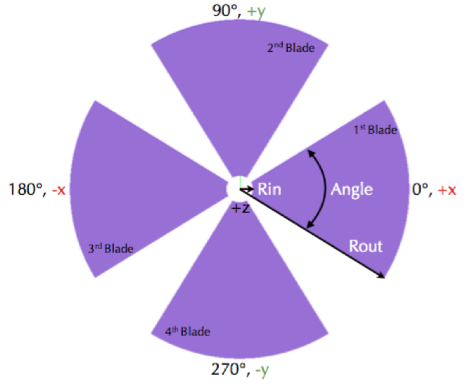

Each blade is constructed in the counterclockwise order. The figure shows its shape with coordination system.

Here is the complete set of the parameters for the above Propeller::

    # Common parameters: type of geometry, position, and rotation
    s:Ge/PropellerA/Type = "TsPropeller" #TsPropeller as type of geometry
    s:Ge/PropellerA/Parent = "World"
    s:Ge/PropellerA/Material = "Parent" #This is required to be set as "Parent"
    d:Ge/PropellerA/TransX = 0.0 cm
    d:Ge/PropellerA/TransY = 0.0 cm
    d:Ge/PropellerA/TransZ = 0.0 cm
    d:Ge/PropellerA/RotX = 0.0 deg
    d:Ge/PropellerA/RotY = 0.0 deg
    d:Ge/PropellerA/RotZ = 0.0 deg
    b:Ge/PropellerA/Invisible = "true" #To avoid visualize propeller’s mother volume.

    i:Ge/PropellerA/NbOfBlades = 4 #Number of blades
    d:Ge/PropellerA/Rin = 10.0 mm #Inner radius, Rin in the figure
    d:Ge/PropellerA/Rout = 127.5 mm #Outer radius, Rout in the figure

    dv:Ge/PropellerA/Thickness =1 0.356 mm #thickness.
    dv:Ge/PropellerA/Angles =1 63.15 deg #span angle of each blade.
    sv:Ge/PropellerA/Materials =1 "G4_POLYVINYL_ACETATE" #material.

    # Visualization attributes setting
    s:Ge/PropellerA/Blade/Material = Ge/PropellerA/Material
    s:Ge/PropellerA/Blade/Color = "skyblue"
    s:Ge/PropellerA/Blade/DrawingStyle = "Solid"
    i:Ge/PropellerA/Blade/VisSegsPerCircle = 360
    # you can apply a propeller specific step size
    d:Ge/PropellerA/Blade/MaxStepSize = 10 mm
    b:Ge/PropellerA/PrintInformation = "True" #Print out specification, see below

While TOPAS starts to build geometries, you can confirm whether the numbers you put are input properly from console output as:

.. code-block:: plain

    Layer: "0" , Thickness: 0.0356 (cm), Angle: 63.15 (deg), Material: G4_POLYVINYL_ACETATE
      Blade "0", Angle (-31.575 deg, 31.575deg)
      Blade "1", Angle (88.425 deg, 151.575deg)
      Blade "2", Angle (208.425 deg, 271.575deg)

With different numbers of blades, the angle of each blade will look like:

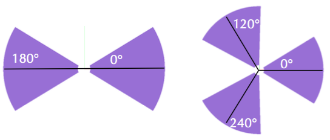

(Left) ``Ge/PropellerA/NbOfBlades = 2``, (Right) ``Ge/PropellerA/NbOfBlades = 3``.

You can model a multiple layered propeller just by extending the vector parameters, such as ``Thickness``, ``Angles``, and ``Materials`` (for more detail, see :ref:`example_special_propeller`)::

    dv:Ge/PropellerA/Thickness=10
    0.5 0.6 0.7 0.8 0.9 1.0 1.1 1.2 1.3 1.4 mm
    dv:Ge/PropellerA/Angles=10
    63.15 54.15 46.450 40.65 35.85 31.8 28.1 24.725 21.8 19.1 deg
    sv:Ge/PropellerA/Materials=10
    "Lexan" "G4_WATER" "G4_POLYVINYL_ACETATE" "G4_POLYVINYL_ACETATE"
    "G4_POLYVINYL_ACETATE" "G4_POLYVINYL_ACETATE" "G4_POLYVINYL_ACETATE"
    "G4_POLYVINYL_ACETATE" "G4_POLYVINYL_ACETATE" "G4_POLYVINYL_ACETATE"

Layers are created in the order of the parameter vector, i.e., Lexan is the bottom layer in this case, Water layer is the next, and so on. It is possible to make each layer with different thickness, angles, and materials. Note that these three vector parameters have same number of elements.

TOPAS propeller allows only the rotation around z-axis, which means that you can only assign rotation :ref:`Time Feature <time_feature>` to ``RotZ``, such as ``Ge/PropellerA/RotZ = Tf/ContinuousRotation/Value.`` Two examples demonstrate how to handle propeller rotations (:ref:`example_special_propeller_continuous` and :ref:`example_special_propeller_step`).

.. _geometry_ridgefilter:

Ridge Filter
~~~~~~~~~~~~

A ridge filter is an energy modulation component used in proton therapy. TOPAS offers a generic way to model an arbitrary shape of a ridge and place the replica. The shape of a ridge is defined in the x-z plane and then it becomes a volume by extending in the y direction.

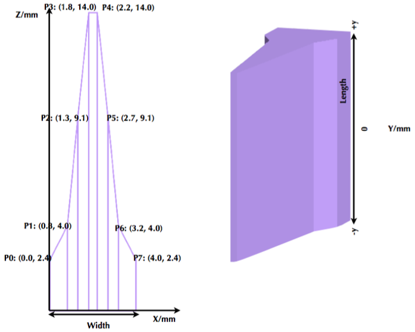

(left) A ridge shape in X-Z plane, represented by points-connection. Because the connection starts at the origin and ends at the last point, (width, 0), so users need to define the width of a ridge first. Depending on the topology of points, the arbitrary shape can be constructed. (right) A complete ridge by extending the shape along with y axis.

Here is a complete set of the parameters for the above ridge filter (see :ref:`example_special_ridgefilter` example)::

    # Common parameters: type of geometry, position, and rotation
    s:Ge/RidgeFilterA/Type = "TsRidgeFilter"
    s:Ge/RidgeFilterA/Parent = "RidgeGroup"
    s:Ge/RidgeFilterA/Material = "Aluminum"
    d:Ge/RidgeFilterA/TransX = 0.0 cm
    d:Ge/RidgeFilterA/TransY = 0.0 cm
    d:Ge/RidgeFilterA/TransZ = 0.0 cm
    d:Ge/RidgeFilterA/RotX = 0.0 deg
    d:Ge/RidgeFilterA/RotY = 0.0 deg
    d:Ge/RidgeFilterA/RotZ = 0.0 deg
    s:Ge/RidgeFilterA/DrawingStyle = "Solid"

    #Ridge Filter-specific parameters;
    #Width definition
    #Note that points are sequentially connected.
    #Number of XPoints and YPoints should be same.
    dv:Ge/RidgeFilterA/XPoints = 8
    0.0 0.8 1.3 1.8 2.2 2.7 3.2 4.0 mm
    dv:Ge/RidgeFilterA/ZPoints = 8
    2.4 4.0 9.1 14.0 14.0 9.1 4.0 2.4 mm
    d:Ge/RidgeFilterA/Width = 4.0 mm
    d:Ge/RidgeFilterA/Length = 1.0 cm

To check that the numbers are input properly::

    b:Ge/RidgeFilterA/PrintInformation = "True"

will generate console output as:

.. code-block:: plain

    Ridge points (x,z) --- :8
      P initial : (0, 0) cm
      P 0th     : (0, 0.24) cm
      P 1st     : (0.08, 0.4) cm
      P 2nd     : (0.13, 0.91) cm
      P 3rd     : (0.18, 1.4) cm
      P 4th     : (0.22, 1.4) cm
      P 5th     : (0.27, 0.91) cm
      P 6th     : (0.32, 0.4) cm
      P 7th     : (0.4, 0.24) cm
      P final   : (0.4, 0) cm

You can make replicas of the ridge and their positions along the x-axis.
A total of 3 replicas of the ridge and placed at -5.0, 0.0, 5.0. Each point represents the x-coordinate of the center of ridge width::

    dv:Ge/RidgeFilterA/Displacement = 3 -5.0 0.0 5.0 mm

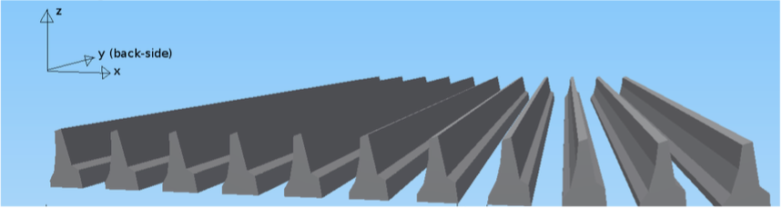

An example of replica set.

.. _geometry_mwc:

Multi Wire Chamber
~~~~~~~~~~~~~~~~~~

A multi wire chamber may be built from many of geometry primitives such as TsBox and TsCylinder. However, It is quite cumbersome to place many wires individually and adjust their dimension on any request. So TOPAS multi wire chamber (TsMultiWireChamber) allows to instantiate many wires and to place them efficiently. TsMultiWireChamber is a box consisting of multiple sets of wires. Each set can have its own configuration, such as the dimension and material of the wires, spaces between wires, alignment axis, Z-positions, and drawing-style.

Here is an example of TsMultiWireChamber (see :ref:`example_special_mwc` example).

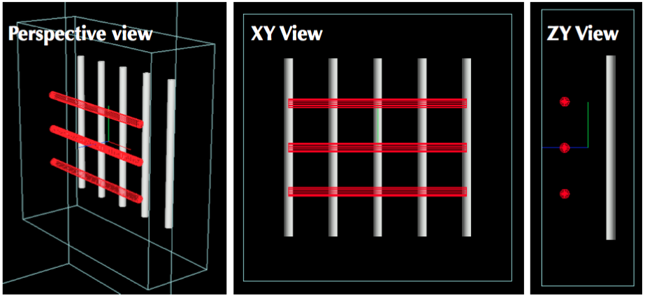

TOPAS multi wire chamber consists of two wire sets aligned along the X and Y axes. Three red wires are aligned to X axis while four gray wires are aligned to Y axis. These two sets of wires are placed within their mother box (gas filed).

The following parameters show how to model the above multi wire chamber::

    s:Ge/WireChamberA/Parent = "World"
    s:Ge/WireChamberA/Type = "TsMultiWireChamber" #Type of geometry
    d:Ge/WireChamberA/HLX=30.0 cm #Chamber dimension
    d:Ge/WireChamberA/HLY=30.0 cm
    d:Ge/WireChamberA/HLZ=10.0 cm
    s:Ge/WireChamberA/Material="Air" #Chamber is filled with this material.
    d:Ge/WireChamberA/TransX=0.0 cm
    d:Ge/WireChamberA/TransY=0.0 cm
    d:Ge/WireChamberA/TransZ=0.0 cm
    d:Ge/WireChamberA/RotX=0.0 deg
    d:Ge/WireChamberA/RotY=0.0 deg
    d:Ge/WireChamberA/RotZ=0.0 deg
    i:Ge/WireChamberA/NbOfLayers=2 #Number of wire sets.

    # Parameters for specifying each wire set add ‘Layer#’ to geometry name.
    # So Layer1 to Layer’NumberofLayers’.
    d:Ge/WireChamberA/Layer1/RMin=0.0 cm #Wire’s inner radius
    d:Ge/WireChamberA/Layer1/RMax=1.0 cm #Wire’s outer radius
    s:Ge/WireChamberA/Layer1/Material="Brass" #Wire material
    d:Ge/WireChamberA/Layer1/HL=20.0 cm #Wire’s half length
    s:Ge/WireChamberA/Layer1/Align= "X" #Align axis
    dv:Ge/WireChamberA/Layer1/Displacement=3 -10 0 10 cm #number of wires and its position in Y, because wires are aligned to X axis)
    d:Ge/WireChamberA/Layer1/PosZ=5.0 cm #Z-position w.r.t its mother box.
    s:Ge/WireChamberA/Layer1/DrawingStyle="FullWireFrame"
    s:Ge/WireChamberA/Layer1/Color="red"

    d:Ge/WireChamberA/Layer2/RMin=0.5 cm
    d:Ge/WireChamberA/Layer2/RMax=1.0 cm
    s:Ge/WireChamberA/Layer2/Material="Lexan"
    d:Ge/WireChamberA/Layer2/HL=20.0 cm
    s:Ge/WireChamberA/Layer2/Align= "Y"
    dv:Ge/WireChamberA/Layer2/Displacement=5 -20 -10 0 10 20 cm
    d:Ge/WireChamberA/Layer2/PosZ=-5.0 cm
    s:Ge/WireChamberA/Layer2/DrawingStyle="Solid"
    b:Ge/WireChamberA/PrintInformation = "True" #Print out specification, see below

When TOPAS starts to build geometries, you will see the numbers are input properly from console output as:

.. code-block:: plain

    Layer: "0" , # of Wires: 3, Alignment: X, Wire (Rmin= 0 cm, Rmax= 1 cm, HL= 20 cm) , Z Position in the Chamber: 5 (cm)
      Wire "0", Position (0 cm, -10 cm)
      Wire "1", Position (0 cm, 0 cm)
      Wire "2", Position (0 cm, 10 cm)
    Layer: "1" , # of Wires: 5, Alignment: Y, Wire (Rmin= 0.5 cm, Rmax= 1 cm, HL= 20 cm) , Z Position in the Chamber: -5 (cm)
      Wire "0", Position (-20 cm, 0 cm)
      Wire "1", Position (-10 cm, 0 cm)
      Wire "2", Position (0 cm, 0 cm)
      Wire "3", Position (10 cm, 0 cm)
      Wire "4", Position (20 cm, 0 cm)

.. _geometry_mlc:

Multi Leaf Collimator
~~~~~~~~~~~~~~~~~~~~~
TOPAS provides a simple Multi Leaf Collimator (MLC) and a doubly diverging MLC. The simple MLC (type = TsMultiLeafCollimator) is comprised of rectangular parallelopipeds (six rectangular surfaces, at right angles with each other).

The simple TOPAS MLC has a minimal set of parameters to define the width and opening (travel) of each leaf.

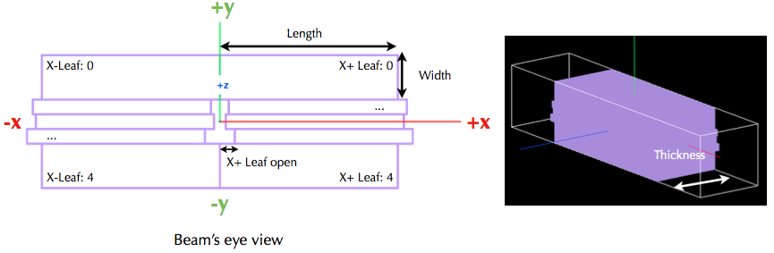

Illustrations for TOPAS MLC dimensions. The user can define an arbitrary number of leaves with different width of each leaf. TOPAS detects leaf collision when it is built and leaves are repositioned by :ref:`time_feature` operations.

Here is a complete set of the parameters for the above TOPAS MLC (see :ref:`example_special_mlc` example)::

    # Common parameters: type of geometry, position, and rotation
    s:Ge/MultiLeafCollimatorA/Type = "TsMultiLeafCollimator"
    s:Ge/MultiLeafCollimatorA/Parent = "World"
    s:Ge/MultiLeafCollimatorA/Material = "Aluminum"
    d:Ge/MultiLeafCollimatorA/TransX = 0.0 cm
    d:Ge/MultiLeafCollimatorA/TransY = 0.0 cm
    d:Ge/MultiLeafCollimatorA/TransZ = 0.0 cm
    d:Ge/MultiLeafCollimatorA/RotX = 0.0 deg
    d:Ge/MultiLeafCollimatorA/RotY = 0.0 deg
    d:Ge/MultiLeafCollimatorA/RotZ = 0.0 deg
    s:Ge/MultiLeafCollimatorA/DrawingStyle = "Solid"
    b:Ge/MultiLeafCollimatorA/PrintInformation = "True"

    # MLC-specific parameters:
    # Limits Leaf opening. Any of absolute values from X+- Leaf can’t exceed this value.
    d:Ge/MultiLeafCollimatorA/MaximumLeafOpen = 5.0 cm
    d:Ge/MultiLeafCollimatorA/Thickness = 5.0 cm #Leaf thickness (z)
    d:Ge/MultiLeafCollimatorA/Length = 6.0 cm #Leaf length (y)
    dv:Ge/MultiLeafCollimatorA/Widths = 5 1.5 0.5 0.5 0.5 1.5 cm #Leaves width

    # Each leaf’s opening distance from Y axis.
    # XMinusLeavesOpen means the x position of X- leaf’s right edge.
    # XPlusLeavesOpen means the x position of X+ leaf’s left edge.
    dv:Ge/MultiLeafCollimatorA/XMinusLeavesOpen = 5 0.0 -0.3 -0.2 -0.5 0.0 cm
    dv:Ge/MultiLeafCollimatorA/XPlusLeavesOpen = 5 0.0 0.3 0.2 0.5 0.0 cm

TOPAS MLC is a specialized geometry and so allows only the reposition of each leaf as a function of time, using :ref:`time_feature` (see :ref:`example_special_mlc_sequence` example).

The doubly diverging MLC (type = TsDivergingMLC) is comprised of trapezoids. 

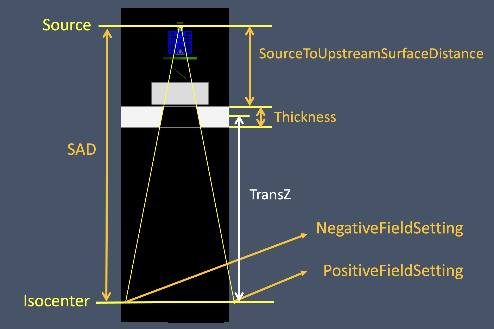

TsDivergingMLC component with select parameters set in the parameter control file shown in orange. 
In this case there is an MLC bank downstream of an asymmetric pair of jaws. TransZ is at the middle 
of the MLC (half thickness) and is provided as a changeable parameter in the TOPAS GUI even though 
it is not present in a parameter control file.

The following parameter set fully specifies a pair of MLC banks with doubly diverging leaves, in this 
case, a symmetric 20 cm x 10 cm field at isocenter collimated by a Siemens Oncor MLC. If the leaf i
travel axis is X, the leaf numbering is from negative to positive along Y. If the leaf travel axis i
is Y, the leaf numbering is from positive to negative along X.::

  s:Ge/MLC/Parent           = "World" 
  s:Ge/MLC/Type              = "TsDivergingMLC"
  s:Ge/MLC/Material         = "G4_W"
  d:Ge/MLC/SAD               = 100. cm 
  d:Ge/MLC/SourceToUpstreamSurfaceDistance = 28.26  cm # Distance from source to MLC bank
  s:Ge/MLC/LeafTravelAxis   = "X" # Leaf travel axis, "X" or "Y"
  d:Ge/MLC/MaximumLeafOpen  = 20.0 cm # Actual limit of leaf travel
  d:Ge/MLC/Thickness        = 7.56 cm # Actual thickness of MLC leaves along IEC Zb
  d:Ge/MLC/Length           = 20.0 cm # Length of MLC leaves in direction of travel
  # MLC leaf widths and positions, projected to isocenter for 10 cm x 20 cm field
  dv:Ge/MLC/LeafWidths           = 42 5. 1. 1. 1. 1. 1. 1. 1. 1. 1. 1. 1. 1. 1. 1. 1. 1. 1. 1. 1. 1. 1. 1. 1. 1. 1. 1. 1. 1. 1. 1. 1. 1. 1. 1. 1. 1. 1. 1. 1. 1. 5. cm
  dv:Ge/MLC/NegativeFieldSetting = 42 0. 0. 0. 0. 0. 0. 0. 0. 0. 0. 0. -5. -5. -5. -5. -5. -5. -5. -5. -5. -5. -5. -5. -5. -5. -5. -5. -5. -5. -5. -5. 0. 0. 0. 0. 0. 0. 0. 0. 0. 0. 0. cm
  dv:Ge/MLC/PositiveFieldSetting = 42 0. 0. 0. 0. 0. 0. 0. 0. 0. 0. 0. 5. 5. 5. 5. 5. 5. 5. 5. 5. 5. 5. 5. 5. 5. 5. 5. 5. 5. 5. 5. 0. 0. 0. 0. 0. 0. 0. 0. 0. 0. 0. Cm
  s:Ge/MLC/DrawingStyle = "Solid"

.. _geometry_cad:

CAD (Computer Aided Design)
~~~~~~~~~~~~~~~~~~~~~~~~~~~

The TsCAD component allows you to turn any geometry that has been designed in a CAD system into a TOPAS Component. This allows you to incorporate arbitrarily complex geometries.

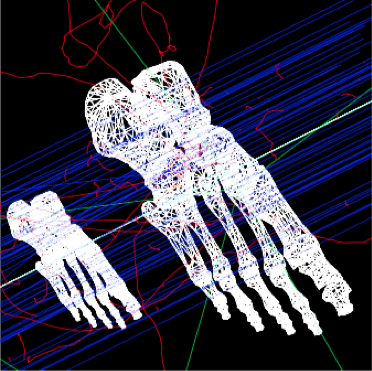

The supported CAD formats are:

* STL - Stereolithography binary format
* PLY - Polygon ASCII format

STL and PLY files describe a geometry as a tessellation, providing a set of vertices and faces of triangular or quadrangular surfaces to approximate the volume. While some STL and PLY files also contain additional information such as material and color, TOPAS does not currently accept such information. The STL and PLY files you provide to TOPAS must contain only the tessellation information. Internally, TOPAS represents this component as a ``G4TessellatedSolid``.

Most CAD systems allows direct export of parts to the above formats. If your CAD system does not support one of those formats, you may be able to convert from some other CAD format by using a free conversion tool such as `MeshLab <http://meshlab.sourceforge.net>`_.

::

    # Common parameters: type of geometry, position, and rotation
    s:Ge/MyPartFromCAD/Type = "TsCAD"
    s:Ge/MyPartFromCAD/Parent = "World"
    s:Ge/MyPartFromCAD/Material = "G4_WATER"
    d:Ge/MyPartFromCAD/TransX = 0.0 cm
    d:Ge/MyPartFromCAD/TransY = 0.0 cm
    d:Ge/MyPartFromCAD/TransZ = 0.0 cm
    d:Ge/MyPartFromCAD/RotX = 0.0 deg
    d:Ge/MyPartFromCAD/RotY = 0.0 deg
    d:Ge/MyPartFromCAD/RotZ = 0.0 deg
    s:Ge/MyPartFromCAD/DrawingStyle = "Wireframe"

    # CAD-specific parameters:
    s:Ge/MyPartFromCAD/InputFile = "Foot" # file name, without extensions. Match exact case
    s:Ge/MyPartFromCAD/FileFormat = "ply" # file extension
    d:Ge/MyPartFromCAD/Units = 1.0 cm # how to interpret dimension numbers in the file. Changing this value will re-scale the component

TOPAS does not automatically know where the center of your CAD component will be. This is affected by how your CAD system manages coordinates. For example, some CAD software exports the STL by relocating the volume to the first positive octant of its coordinate system. You may have to adjust the ``TransX/Y/Z`` parameters of your component to center it as desired.

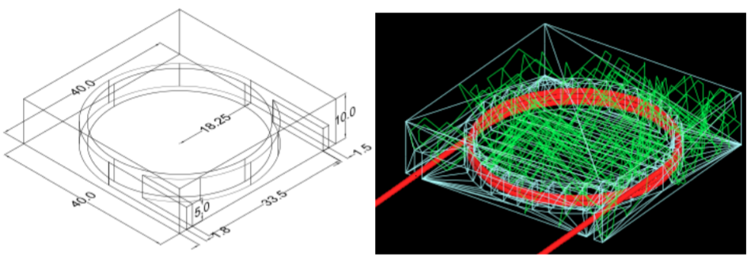

Above, A plastic scintillator with customized groove. Left: CAD, Right: TOPAS

.. _geometry_aperture:

Aperture
~~~~~~~~

An aperture is a component used to shape the lateral penumbra of a (generally) double-scattered proton beam. It is basically a block of brass with a hole cut out from the middle, in the shape of the treatment volume. The purpose is to block the beam outside the desired irradiation path.
TOPAS models the aperture by connecting the aperture file points to create a polygon and then extruding this polygon in Z to cut out the aperture hole.

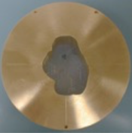

A typical implementation of an apertures in TOPAS is given below followed by a more detailed description of each option
(see :ref:`example_nozzle_scattering` example)::

    s:Ge/Aperture/Type = "TsAperture"
    s:Ge/Aperture/Parent = "Snout"
    s:Ge/Aperture/Material= "Brass"
    d:Ge/Aperture/RMax =4.5 cm
    d:Ge/Aperture/HL= 2.5 cm
    d:Ge/Aperture/TransX = 0.0 cm
    d:Ge/Aperture/TransY = 0.0 cm
    d:Ge/Aperture/TransZ = -13.0 cm
    d:Ge/Aperture/RotX = 0.0 deg
    d:Ge/Aperture/RotY = 0.0 deg
    d:Ge/Aperture/RotZ = 0.0 deg
    s:Ge/Aperture/InputFile = "ApertureFileIn.ap" # Match exact case
    s:Ge/Aperture/FileFormat = "XYCoordinates" # XYCoordinates or MGH
    b:Ge/Aperture/PrintPoints = "True" # Print points to console

``FileFormat`` has two options:

* ``"XYCoordinates"`` takes is a simple list of points. The first line defines how many points there are in the file, each following line in the file is a comma separated x,y pair, such as:

    * numberOfPoints
    * x1,y1
    * x2,y2
    * ...
    * xN,yN

  N = numberOfPoints is the number of data points (xi, yi). This is a required condition. The units of the coordinates are millimeter.
* ``"MGH"`` takes the milling data produced by the MGH machine shop. It consists of the same information as the ``"XYCoordinates"`` option, but with more overhead, such as:

    * patientName
    * Warning message about not fabricating this file
    * someDoubleValue
    * someIntValue
    * M (this is a number of dummy points, this amount of points will be skipped)
    * x1 y1 x2 y2 ... xM yM
    * N
    * x1 y1 x2 y2 ... xN yN

  Data pairs are listed in a simple space-separated list. The units are in centimeter.

.. _geometry_compensator:

Compensator
~~~~~~~~~~~

A compensator is a component that is used to shape the distal edge of a proton beam by placing a varying amount of material in the beam path, usually behind the aperture. An example compensator is shown below in top and side views. The compensator consists of a material that is to be placed in the beam to attenuate the beam (usually lexan) and a number of drill holes that were drilled into the compensator.

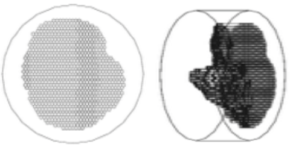

A typical compensator has the following parameters (see :ref:`example_nozzle_scattering` example)::

    s:Ge/Compensator/Type = "TsCompensator"
    s:Ge/Compensator/Parent = "Snout"
    s:Ge/Compensator/Material = "CompensatorLucite"
    d:Ge/Compensator/RMax = 5.5. cm
    d:Ge/Compensator/TransX = 0. cm
    d:Ge/Compensator/TransY = 0. cm
    dc:Ge/Compensator/Thickness = 0. cm # will be reset to actual thickness when compensator is read in. This allows other parameter files to access this variable thickness.
    d:Ge/Compensator/InvHL = -0.5 * Ge/Compensator/Thickness cm
    d:Ge/Compensator/TransZ = -15.5 cm + Ge/Compensator/InvHL # Allows centering regardless of thickness
    d:Ge/Compensator/RotX = 0. deg
    d:Ge/Compensator/RotY = 0. deg
    d:Ge/Compensator/RotZ = 0. deg
    s:Ge/Compensator/InputFile = "CompensatorFileInRowsDepths.rc" # match exact case
    s:Ge/Compensator/FileFormat = "RowsAndDepths" # RowsAndDepths or MGH
    s:Ge/Compensator/Method = "ExtrudedSolid" # Polyhedra, ExtrudedSolid, SubtractionCylinders or UnionCylinders
    b:Ge/Compensator/PrintPoints = "True"

``Thickness`` has the special parameter type, ``dc``, where the ``c`` means this dimensioned double is :ref:`changeable <changeable_parameters>`, that is, it can change on the fly based on what exact compensator is read in. Other parameters can then take this thickness into account when the perform placements.

``FileFormat`` has two options:

* ``"RowsAndDepths"``: all sizes are in millimeters:

    * numberOfRows
    * MainCylinderThickness
    * DrillHoleDiameter
    * n1 deltaX1 X1 Y1
    * D1 D2 ... Dn1
    * n2 deltaX2 X2 Y2
    * D1 D2 ... Dn2
    * ...
    * nN deltaXn Xn Yn
    * D1 D2 ... DnN

  NumberOfRows = N defines how many rows of drill holes there are (in Y), the MainCylinderThickness. The DrillHoleDiameter is the diameter of the drill hole, we approximate this by a hexagon. The values ni are the number of drill holes in X for each row of drill holes in Y, deltaXi defines the step size (and direction) and Xi and Yi are the starting position of the drilling for this row.

* ``"MGH"``: all sizes are in inches:

    * Some line
    * numberOfRows
    * dummyDouble dummyDouble dummyDouble dummyDouble
    * MainCylinderThickness
    * dummyDouble dummyDouble dummyDouble dummyDouble dummyDouble dummyDouble dummyDouble
    * DrillHoleDiameter
    * n1 deltaX1 X1 Y1
    * D1 D2 ... Dn1
    * n2 deltaX2 X2 Y2
    * D1 D2 ... Dn2
    * ...
    * nN deltaXn Xn Yn
    * D1 D2 ... DnN

``Method`` has four options:

* ``"ExtrudedSolid"`` builds the compensator from a set of extruded solids. This is the most reliable and efficient technique.
* ``"Polyhedra"`` carves hexagon shapes out of the compensator. This method has an extra check to adjust the position of each starting drill hole of each row to compensate for rounding inaccuracies produced by the drilling machine::

    d:Ge/Compensator/XTolerance = 1. mm
    d:Ge/Compensator/YTolerance = 1. mm

* ``"SubtractionCylinders"`` builds the compensator by subtracting drill hole cylinders from the overall compensator cylinder. This technique gives the most perfect representation of the drilling process, however the added precision is insignificant, while particle navigation time is increased. Note that if you want to visualize this form of compensator, you should use RayTracer, as this is the only Geant4 visualization drivers that can correctly render boolean operations.
* ``"UnionCylinders"`` builds the compensator by first creating a union solid of all the holes, and then subtracting this union solid from the overall compensator cylinder. This technique is similar to ``"SubtractionCylinders"`` but slightly more efficient. Note that if you want to visualize this form of compensator, you should use RayTracer, as this is the only Geant4 visualization drivers that can correctly render boolean operations.

.. _geometry_applicator:

BrachyApplicator
~~~~~~~~~~~

A BrachyApplicator is a component that is used to precisely place
source wires for brachytherapy applications.
It is the first of what we intend to become a large library of new
compoents for brachytherapy applications.

The overall shape of the BrachyApplicator is a cylinder with a hemispherical cap on one end.
There is one hole in the center into which a source wire can be driven,
plus a configurable number of other holes located radially around this center.
The component generates additional parameters at run-time to represent
the x and y translations of these holes relative to the applicator center line.
These parameters can be used to easily postion the source wire into these holes.

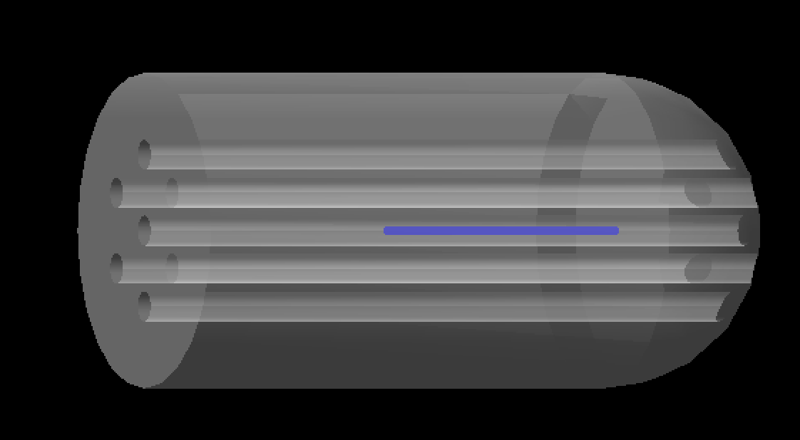

The following example parameters are taken from the new example:
examples/Patient/Applicator.txt
This example places the applicator inside of a patient,
and then uses time features to drive a source wire to various dwell
positions within this applicator.

The parameters you set are as follows.::

    s:Ge/Applicator/Type = "TsBrachyApplicator"
    s:Ge/Applicator/Parent = "Patient"
    b:Ge/Applicator/IsParallel = "True"
    s:Ge/Applicator/Material = "G4_WATER"
    d:Ge/Applicator/CylinderLength = 40. mm
    d:Ge/Applicator/Radius = 12.5 mm
    i:Ge/Applicator/NumberOfRadialHoles = 6
    d:Ge/Applicator/HoleOffset = 6 mm # Distance of radial holes from center
    d:Ge/Applicator/HoleRadius = 1.2 mm
    s:Ge/Applicator/DrawingStyle = "Solid"
    s:Ge/Applicator/Color = "transparentgrey"
    iv:Gr/Color/transparentgrey = 4 255 255 255 90

The following parameters are updated automatically by the applicator component to show true hole centers.
They need to be defined here, but these initial values are not important.
They must run from Hole0 (for the central hole) to HoleN, for the Nth radial hole.::

    d:Ge/Applicator/Hole0/TransX = 0. mm
    d:Ge/Applicator/Hole0/TransY = 0. mm
    d:Ge/Applicator/Hole1/TransX = 0. mm
    d:Ge/Applicator/Hole1/TransY = 0. mm
    d:Ge/Applicator/Hole2/TransX = 0. mm
    d:Ge/Applicator/Hole2/TransY = 0. mm
    d:Ge/Applicator/Hole3/TransX = 0. mm
    d:Ge/Applicator/Hole3/TransY = 0. mm
    d:Ge/Applicator/Hole4/TransX = 0. mm
    d:Ge/Applicator/Hole4/TransY = 0. mm
    d:Ge/Applicator/Hole5/TransX = 0. mm
    d:Ge/Applicator/Hole5/TransY = 0. mm
    d:Ge/Applicator/Hole6/TransX = 0. mm
    d:Ge/Applicator/Hole6/TransY = 0. mm

.. _geometry_jaws:

Jaws
~~~~~~~~~~~
TOPAS provides a component to specify a pair of asymmetric, diverging jaws (type = TsJaws), e.g., 
as part of a linear accelerator treatment head. The component is built from Geant4 trapezoids.

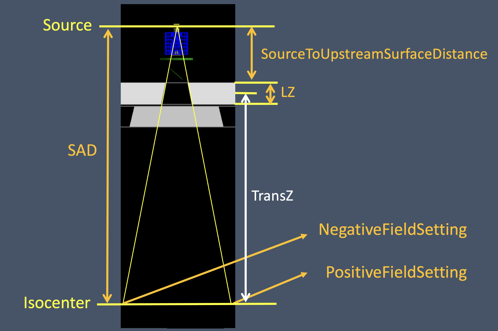

  TsJaws component with select parameters set in the parameter control file shown in orange. In this 
  case there is an asymmetric pair of jaws upstream of a MLC bank. TransZ is at the middle of the 
  jaw (half thickness) and is provided as a changeable parameter in the TOPAS GUI even though it 
  is not present in a parameter control file.

The following parameters are shown in the diagram above:
  1. The SAD parameter is the source-axis distance; that is, the distance from the nominal source 
     position (x-ray target) to the gantry rotation axis (the machine isocenter).
  2. The distance from the origin of the coordinate system to the jaw is calculated from the 
     parameters SAD and SourceToUpstreamSurfaceDistance. This is for consistency in jaw positioning 
     with the other components in the linear accelerator simulation example. 
  3. The NegativeFieldSetting and PositiveFieldSetting parameters specify the setting of each jaw 
     as the distance from the coordinate system Z axis to each jaw surface, projected to the plane 
     perpendicular to the Z at the origin of the coordinate system (isocenter). This is the field 
     setting used in treatment planning systems and at the machine. NegativeFieldSetting is less 
     than or equal to PositiveFieldSetting. 

The following parameter set specifies a symmetric 10 cm wide field at isocenter collimated by a Siemens Oncor jaw::

  s:Ge/Jaw/JawTravelAxis  = "X" # Jaw travel axis, "X" or "Y"
  d:Ge/Jaw/PositiveFieldSetting  = 20 cm
  d:Ge/Jaw/NegativeFieldSetting  = -20 cm
  s:Ge/Jaw/Parent  = "World"
  s:Ge/Jaw/Type  = "TsJaws"
  s:Ge/Jaw/Material = "G4_W"
  d:Ge/Jaw/LX  = 20. cm  # Actual jaw width along JawTravelAxis
  d:Ge/Jaw/LY  = 20. cm  # Actual jaw length perpendicular to JawTravelAxis
  d:Ge/Jaw/LZ  = 7.80 cm # Jaw thickness along Z axis
  dc:Ge/Jaw/SourceToUpstreamSurfaceDistance = 19.73 cm #Distance from source to jaw 
  d:Ge/Jaw/SAD = 100. cm #Distance for source to isocenter
  s:Ge/Jaw/DrawingStyle = "Solid"

