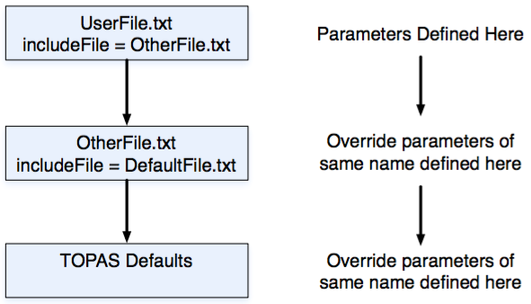
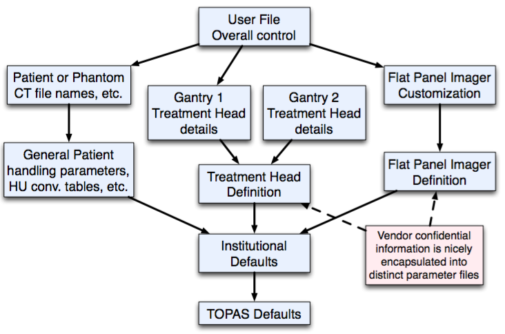

.. _parameters_hierarchy:

Hierarchical Control
--------------------

Parameter files may pull in other parameters through ``includeFile`` statements, such as::

    includeFile = someOtherParameterFile

On most operating systems, the case of the file name matters - MyIncludeFile.txt is not considered the same file as MYIncludeFile.txt - so take care to match the exact case.

``includeFile`` lines may appear anywhere in the parameter file.

``includeFile`` can use either absolute or relative file positions, such as::

    includeFile = /Applications/topas/someDirectory/MyIncludeFile.txt
    includeFile = ../someDirectory/MyIncludeFile.txt

A file inherits all settings from its ``includeFile``s, and can override any of those included settings by setting the same parameter name to a new value.

Type and kind of units has to match type and kind of units for the same parameter name in any ``includeFile``.

Type can be omitted if the same parameter name has already been defined with a type in an ``includeFile``.

When a parameter file includes another parameter file, and this in turn includes another parameter file, we refer to this as a "parameter file chain."

Parameter file chains fit nicely into research workflow. You can define most of your standard settings in one file, while a file higher on the chain overrides just those values that you want to change today.

To define a parameter in terms of the value of the same parameter in an ``includeFile``, set the value to the same parameter name (always interpreted to mean this parameter value from an includeFile) or use the shortcut value, ``inheritedValue``. The following example would set a foil to be twenty percent thicker than in its included file::

    Ge/IonChamber/Layer2/Foil/HLZ = Ge/IonChamber/Layer2/Foil/HLZ mm * 1.2
    # or
    Ge/IonChamber/Layer2/Foil/HLZ = inheritedValue mm * 1.2

Note that there must be a space before and after the multiplication sign.

A basic set of TOPAS default parameters are built into the system
(see :ref:`Default Parameters <parameters_default>`).
You may override these defaults in your own parameter files if you wish.

.. _parameters_file_graphs:

Parameter File Graphs
~~~~~~~~~~~~~~~~~~~~~

TOPAS is designed to facilitate multiple independent workgroups focused on separate aspects such as treatment head design, patient handling and imaging devices. To this end, a parameter file may inherit settings from more than one other parameter file, forming a structure that is more complex than just a single chain. We refer to such a structure as a "parameter file graph." An example is shown below:

To implement such designs, a parameter file allows any number of includeFile statements, the statements may be located anywhere in the file, and you may specify one or more include files in a single includeFile statement, as in::

    includeFile = someFile someOtherFile someOtherOtherFile
    includeFile = stillAnotherFile

There is no significance to the left to right arrangement. That is::

    includeFile = fileA fileB fileC

will behave the same as::

    includeFile = fileC fileB fileA

or even the same as if this was broken up into multiple includeFile statements::

    includeFile = fileB
    includeFile = fileC fileA

To keep this order from mattering, TOPAS does not allow you to set up a simulation object (a Geometry Component, a Scorer, etc.) in one chain but modify it in a different chain.
All parameters on a given Geometry Component need to be handled in the same chain.
All parameters on a given Scorer need to be handled in the same chain.

TOPAS also checks to make sure that no two parameter file chains modify the same parameter in a way that is ambiguous. If, for example, the material MySpecialTungstenAlloy has been defined in the imaging chain, it cannot also be defined differently in the treatment head chain (unless the top level file, the user file, itself defines this parameter in an absolute way, that is, not relative to any other parameter).

The basic paradigm controlling use of multiple parameter chains is that nothing you do in one chain should magically change the behavior of anything in another chain. Think of the simulation word as an actual physical room. We don't want the behavior of one thing in the room to magically change just because something else entered the room. So when you have multiple chains, TOPAS will check that neither chain modifies anything from the other chain.

This also means that no chain can redefine any of the :ref:`Default Parameters <parameters_default>`, since all of the Default Parameters effectively belong at the base of every chain. The only place you can redefine the Default Parameters is in the top parameter file. This can feel like a heavy requirement, but it is essential. We want TOPAS to be a great tool for use in collaborative research environments where several people or teams may be contributing their own parts of the simulation setup.

It can take some experience to design complex parameter file chains. If you get stuck, feel free to ask for help on the TOPAS User Forum.
