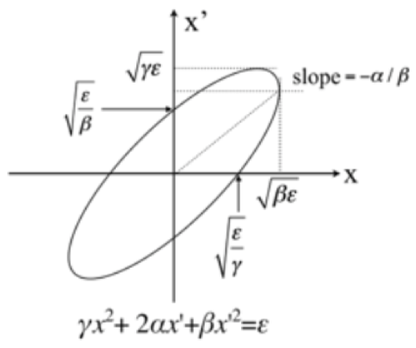
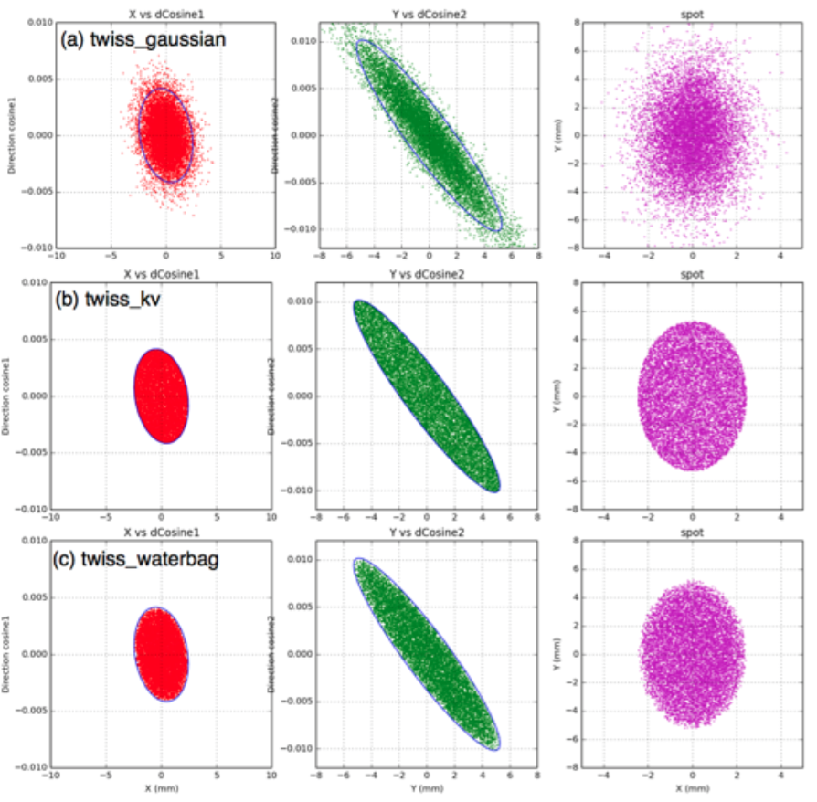

.. _source_emittance:

Emittance Sources
-----------------

Emittance sources provide 4 ways of sampling particles’ position (X and Y) and momentum direction (X’ and Y’) on a plane. Specify source type as::

    s:So/MySource/Type = "emittance"

To sample particle position and momentum direction from “Gaussian” (bivariate 2D gaussian) per axis (see the :ref:`example_basic_emittance_gaussian` example)::

    s:So/MySource/Distribution = "BiGaussian" # distribution name
    d:So/MySource/SigmaX = 0.2 mm # std of x positions
    u:So/MySource/SigmaXprime = 0.032 # std of x’, note that it’s unitless. 1 equals to 1.0 rad.
    u:So/MySource/CorrelationX = -0.9411 # correlation of x and x’
    d:So/MySource/SigmaY = 0.2 mm # std of y positions
    u:So/MySource/SigmaYPrime = 0.032 # std of y’
    u:So/MySource/CorrelationY = 0.9411 # correlation of y and y’

Alternative distributions are TWISS Gaussian, TWISS Kapchinskij-Vladimirskij (KV), and TWISS Waterbag (based on the Courant-Snyder invariant ellipse in the following figure for X axis only):

Additional parameters specify the TWISS alpha, beta and gamma as shown in the following from :ref:`example_basic_emittance_twiss`::

    s:So/MySource/Distribution = "twiss_gaussian" # "twiss_gaussian", "twiss_kv" or "twiss_waterbag"
    u:So/MySource/AlphaX = 0.2
    d:So/MySource/BetaX  = 600.0 mm
    d:So/MySource/EmittanceX = 0.01 mm # we don’t multiply pi intrinsically.
    u:So/MySource/AlphaY = 2.5
    d:So/MySource/BetaY = 1400.0 mm
    d:So/MySource/EmittanceY = 0.02 mm
    # below for twiss gaussian option only
    #0.9 means that 90 % particles will be included in ellipse circle
    u:So/MySource/ParticleFractionX = 0.90
    u:So/MySource/ParticleFractionY = 0.90

The energies and species of the emitted particles and the Cutoff Shape Parameters
can be specified using the same parameters available to the :ref:`source_beam`.

The following images based on the :ref:`example_basic_emittance_twiss` example show how particle position and momentum directions are sampled and the shape of the beam spots (purple). The blue solid lines in X (red dots) and Y (green dots) represent the Courant-Snyder invariant ellipse. For example, 90% of particles are sampled from the given emittance ellipse in (a).

