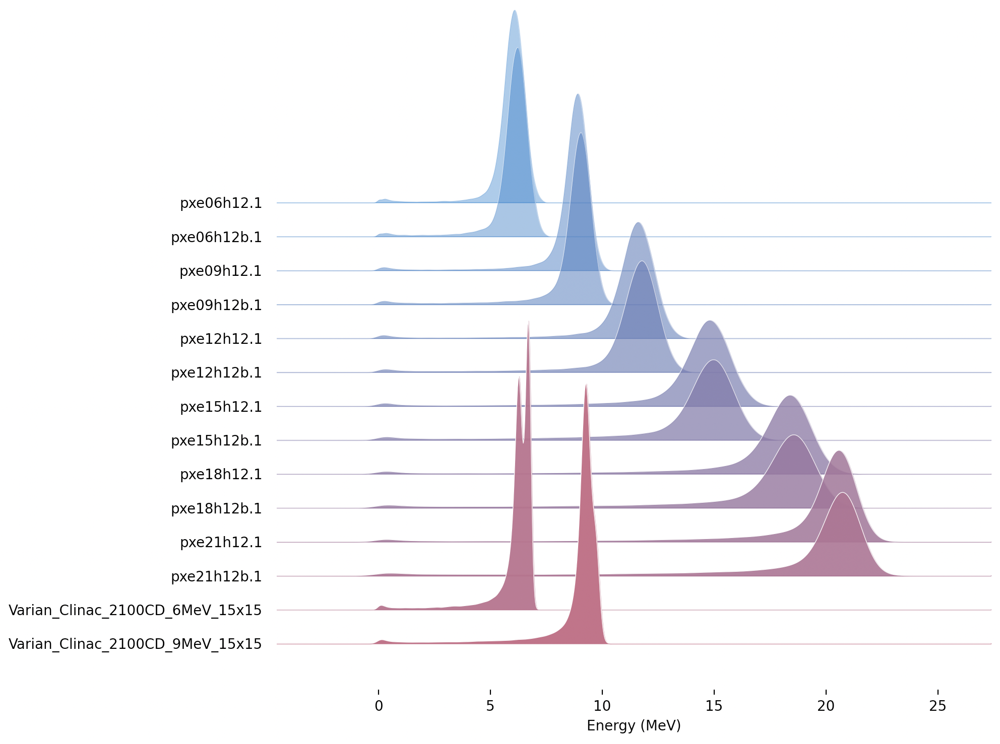
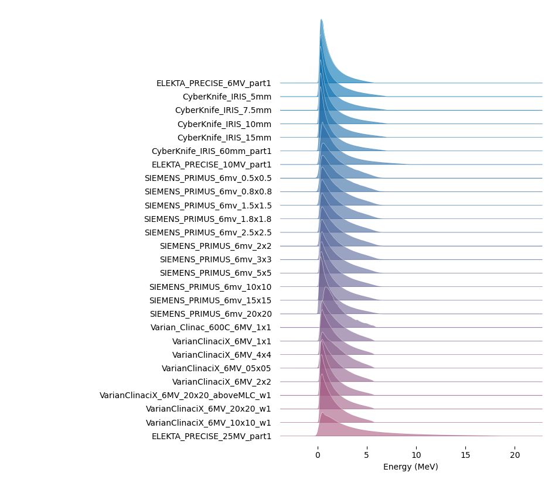

.. _source_phasespace:

Phase Space Sources
-------------------

Phase Space refers to the technique of saving or replaying a set of particles crossing a given surface.

* When one saves a phase space, one defines a surface and then saves the position, particle type, energy and momentum of some or all particles crossing that surface.
* When one replays a phase space, one starts a set of particles from the saved positions, with the saved particle types, energy and momentum.

Phase Space enables separating two parts of a simulation or analysis job, and can be used to transfer sets of particles among different codes.

Each phase space must come as two related files (with same file name but different file extensions):

* A .header file tells the number of histories, the number of saved particles and the order of information in the .phsp file
* A .phsp file contains all the details of all the saved particles

We support three formats for Phase Space (and TOPAS automatically figures out the format of your .phsp file by studying the related .header file):

* ASCII provides particle information in a human-readable text file, which data encoded as a series of columns of text. The header file tells the contents and column order per particle.
* Binary provides the same information as ASCII, but in a much more compact format, with data encoded in a stream of bytes. The header file tells the contents and byte order per particle. Use Binary in cases where the ASCII format produces excessively large files.
* Limited is an alternate binary format compatible with some legacy codes. It has fewer options for what data can be expressed, but is compatible with codes such as that used by Varian for their TrueBeam phase space files. Use Limited format only when you need to exchange phase space with legacy codes.

Some users have found legacy phase space files that were unreadable in the Limited format because, though they were supposed to contain information about which particles represent a new history, there was in fact no new history information. In such cases, it seems that all photons were to be considered new histories. To read such files, use the Limited format with the additional TOPAS parameter::

   b:So/MySource/LimitedAssumePhotonIsNewHistory = "true"

Note that while our Phase Space Scorer lets you also write phase space to `ROOT files <https://root.cern.ch>`_, we do not provide the capability read phase space back in from this format.
For more details, see :ref:`phasespace_format`.

Phase Space sources ignore the parameters starting with "Beam" and instead use::

    s:So/MySource/Type = "PhaseSpace"
    s:So/MySource/Component = "World" # coordinate system of phase space. Usually "World"
    s:So/MySource/PhaseSpaceFileName = "ASCIIOutput" # match exact case

TOPAS will look for header and phsp files with the given ``PhaseSpaceFileName``.

You can generate some sample data by running any of the examples: :ref:`example_phsp_ascii_write`, :ref:`example_phsp_binary_write` or :ref:`example_phsp_limited_write`.

When using phase space sources, it is important to decide how you want to handle a special case we call "Empty Histories." Recall that when a phase space is first recorded, for a given Original History, the set of resulting particles that cross the phase space surface:

* may include the primary particles, or
* may include a mix of primary and secondary particles, or
* may include only secondary particles, or
* may include no particles at all. We refer to this last case as an "Empty History."

The Phase Space Source documentation explains the options for whether and how empty histories are recorded in TOPAS Binary and ASCII phase space files.

When you subsequently use this file as a Phase Space Source, you need to decide how you want TOPAS to handle Empty Histories. If you're just calculating sums, it doesn't matter. The Empty Histories contribute nothing to the sum anyway. But if you're calculating statistical quantities, such as Mean, then these Empty Histories matter. Imagine you want to know the mean dose per Original History. If half of the Original Histories never made it to the phase space file, the decision of whether or not to include these Empty Histories will give a factor of two difference in the calculated Mean Dose per History.

Depending on your use case you may or may not want to include these Empty Histories. It comes down to whether the statistics you want to calculate are:

* per Original History, or
* per Original Histories that Reached Phase Space

You control this with::

    b:So/MySource/PhaseSpaceIncludeEmptyHistories = "False" # defaults to false

TOPAS ASCII and Binary phase space format headers show all of the relevant information:

* Number of Original Histories
* Number of Original Histories that Reached Phase Space
* Number of Scored Particles

Limited phase space format header does not give:

* Number of Original Histories that Reached Phase Space
* so the only way to get that in Limited format is to first read through the entire phsp file and count how many histories contributed there.

TOPAS provides an option to check that the values in the header match what is in the file::

    b:So/MySource/PhaseSpacePreCheck = "True" # defaults to true

For TOPAS ASCII and Binary formats, this is a thorough safety check. It will catch any cases where the files have somehow become corrupted (as could happen, for example, if you are doing a very long phase space writing job and the output disk becomes full during some part of the job).
For Limited format, the check is still helpful but less thorough as the header file provides incomplete information.

While we recommend that users leave the PreCheck process in place,
we accept that the process can be frustratingly slow, as phsp files can be very large.
If you have already checked a given file once, you may want to turn off PreCheck
for subsequent uses of the same phase space file.

PreCheck will print out a progress update after a given number of particles are read.
Default is to print out progress every 1M particles, but this interval can be adjusted with::

    i:So/MySource/PreCheckShowParticleCountAtInterval = 100000

If the phase space you are replaying came from a TOPAS job, the particle starting positions in that file will have been defined relative to the ``World`` Component. Set the ``Component`` parameter above to ``"World"``. If you want to offset these particles to some other center or orientation, choose a Component that has the new desired center and orientation (reuse some existing Component, or define a new Group Component just for this purpose). If the phase space you are replaying did not come from TOPAS, there is no automatic way to know what coordinate system was used. It will be up to you to choose a Component that has this appropriate coordinate system.

You can optionally tell the phase space source to scale its position information::

    u:So/MySource/PhaseSpaceScaleXPosBy = 0.1 # adjust starting point on X axis by factor of 0.1
    u:So/MySource/PhaseSpaceScaleYPosBy = 0.1 # adjust starting point on Y axis by factor of 0.1
    u:So/MySource/PhaseSpaceScaleZPosBy = 0.1 # adjust starting point on Z axis by factor of 0.1
 
You can tell the phase space source to ignore parts of its position information by scaling by zero::

    u:So/MySource/PhaseSpaceScaleXPosBy = 0.
    u:So/MySource/PhaseSpaceScaleYPosBy = 0.
    u:So/MySource/PhaseSpaceScaleZPosBy = 0.

That coordinate of the particle position then just exactly matches the Component center.

You can optionally invert any of the phase space axes by::

    b:So/MySource/PhaseSpaceInvertXAxis = "True"
    b:So/MySource/PhaseSpaceInvertYAxis = "True"
    b:So/MySource/PhaseSpaceInvertZAxis = "True"

In most cases you will instead want to just rotate the source component. However if the handedness of your source phase space is incorrect, one of these invert options will be necessary.

By default, a PhaseSpace source will run all of the histories in the file. To run all of the histories multiple times::

    i:So/MySource/PhaseSpaceMultipleUse = 2 # reuse this phase space multiple times

If you set ``PhaseSpaceMultipleUse`` to zero, the number of histories in the file will be ignored, and we will instead run the exact number from::

    i:So/MySource/NumberOfHistoriesInRun

This may mean only partial use of the phase space file, or partial reuse to get the right number of histories.

* If your data was generated with time dependence, partial reuse of phase space may not give valid results (you may be playing back only a part of the time sequence). Many more details on controlling number of histories are found in :ref:`time_mode`.
* Partial reuse of phase space can not include Empty Histories. There is no statistically valid way to handle these empty histories when the phase space file is only partially used (since one does not know where in the phase space order these Empty Histories would have occurred).

Take care when mixing Phase Space Sources with :ref:`time_feature`.
While TOPAS can save the current TOPAS time to a phase space file, this time is not automatically applied when reading particles back in from phase space. Thus, if you want to correctly replay source particles that were recorded with time features, it is your responsibility to apply the identical time features during the play back simulation. Some additional notes:

* Do not attempt to change the name of the phase space file over time. Save and replay all particles from a single phase space file.
* Do not use :ref:`time_mode_random`. The randomly generated times during playback will not necessarily match the randomly generated times that were saved to the phase space. Only use :ref:`time_mode_fixed` or :ref:`time_mode_sequential`.

A future version of TOPAS will provide more tools to synchronize and check playback time features.

Phase-space files in the IAEA repository

The IAEA has a repository of phase-space files generated by simulation of the treatment head of various models of linear accelerator treatment heads using various Monte Carlo systems. 
Major effort has been put in by those who prepared these files, taking the time to procure the geometry and source details for the simulation, both from fastidious measurements and manufacturer-supplied specifications, running simulations with a lot of histories to generate enough particles to use for precise calculations, and validating the results against measurement. 
TOPAS users may benefit from using these files; however,  be advised that these files have not been validated by the TOPAS team. 

The link to the IAEA repository is https://www-nds.iaea.org/phsp/phsp.htmlx. 
We strongly recommend that users perform their own validation of the phase-space files they download from the IAEA website. 
Phase-space files uploaded to the IAEA repository before 2022 are known as legacy files. 
Most legacy phase-space files from the repository can be read with TOPAS. 
Development of a revised format by a group with representation from IAEA and developers of several Monte Carlo systems began in 2021. 
All files that conform to the revised IAEA phase-space file format specification will be readable by TOPAS. 

The following is a plot of the electron energy distributions for the legacy files that can be read with TOPAS. 

The following is a plot of the x-ray energy distributions for the legacy files that can be read with TOPAS. 

=============================================   ======================================================================================
Phase-space file in IAEA repository 	         Reason the file is not read with TOPAS
X-ray beams…                                    
Elekta_Precise_25mv_part(1a-b,2a-b,3a-b,4a-b)	Number of scored particles listed in the header does not match the number of particles counted in the phase-space file
Siemens_Primus_6mv_1.2x1.2	                     First Particle is not a new history
Siemens_Primus_6mv_ 1x1 	                     First Particle is not a new history
Varian_Clinac_600C_6MV_ 10x10	                  Number of scored particles listed in the header does not match the number of particles counted in the phase-space file
Varian_TrueBeam6MV_(1,2,3,4,5,6)	               First Particle does not have the new history flag set
Electron beams…
Varian_Clinac_2100CD_6MeV_10x10	               Number of scored particles listed in the header does not match the number of particles counted in the phase-space file
Varian_Clinac_2100CD_9MeV_10x10	               Number of scored particles listed in the header does not match the number of particles counted in the phase-space file
===================================             ======================================

Handling of Malformed IAEA phase space files:

Some of the files in the IAEA phase space repository seem to me to be malformed.
Varian_TrueBeam6MV_01, for example, has no New History flags set at all.
It also seems to have a proton as its first particle, even though the header says there are
only photons, electrons and positrons.

We confirmed that some other IAEA files work fine, such as ELEKTA_PRECISE_10mv_part1.

We then added several new features to our reader to be able to read malformed files::

    b:So/MySource/LimitedAssumeFirstParticleIsNewHistory = "true"
    b:So/MySource/LimitedAssumeEveryParticleIsNewHistory = "true"
    b:So/MySource/LimitedAssumePhotonIsNewHistory = "true"

We confirmed that we can read particles from Varian_TrueBeam6MV_01 if we either
set the one parameter::

    b:So/MySource/LimitedAssumeEveryParticleIsNewHistory = "true"

or set the two parameters together::

    b:So/MySource/LimitedAssumeFirstParticleIsNewHistory = "true"
    b:So/MySource/LimitedAssumePhotonIsNewHistory = "true"

We found that if we set only::

    b:So/MySource/LimitedAssumeFirstParticleIsNewHistory = "true"

the job hangs (it tries to accumulate all of the millions of particles into a single history).

Examples reading IAEA files can be found at:

* examples/PhaseSpace/ReadElekta.txt
* examples/PhaseSpace/ReadVarian.txt
