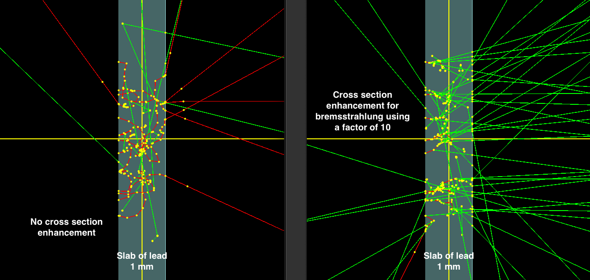

.. _vr_crosssection_enhancement:

Cross section enhancement
-------------------------

In this technique, particle's interaction in a material is enhanced by rescaling the cross-section of a process provided by the user.

This technique is applied at every interaction of the particle. The user needs to provide a unitless scaling factor and the physical processes of interest:: 

    s:Vr/CrossSectionEnhancement/Type = "CrossSectionEnhancement"
    sv:Vr/CrossSectionEnhancement/ProcessesNamed = 1 "eBrem"
    uv:Vr/CrossSectionEnhancement/EnhancementFactor = 1 20

