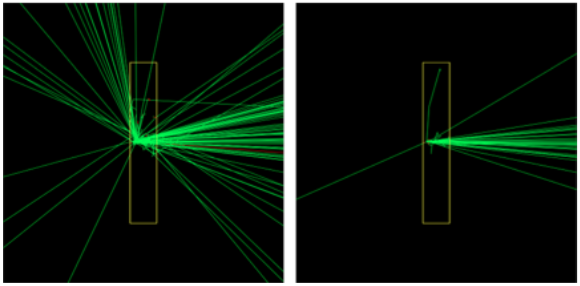

.. _vr_directional_filter:

Directional Filter
==================

Often one is only interested in having low noise data in some particular ROI, however a lot of simulation time can be wasted simulating particles that are very unlikely to reach this ROI. Therefore, in certain situations one may wish to simply kill such particles. To do this, use the settings below (analogous to :ref:`vr_geometrical_splitting`)::

  # Directional particle killing
  # ------------------------------------------------------------
  s:Vr/DirectionalFilter/Type = "DirectionalRussianRoulette"
  s:Vr/DirectionalFilter/ReferenceComponent = "tungsten_Target"
  dv:Vr/DirectionalFilter/ForRegion/VarianceReduction/DirectionalSplitLimits = 2 -1.0 -1.0 m
  sv:vr/DirectionalFilter/ForRegion/VarianceReduction/processesNamed = 2 "eBrem" "compt"
  dv:Vr/DirectionalFilter/ForRegion/VarianceReduction/DirectionalSplitRadius = 2 5.0 5.0 cm

Note that this technique is similar to UseDirectionalSplitting technqiue described in :ref:`_vr_secondary_biasing`. There are two differences:

1. The directional filter technique does not need to be applied in conjunction with secondary biasing.
2. The directional filter technique kills particles, whereas the directional splitting technique applies russian roulette. (we know that the way these techniques are currently named is confusing; we are working on it!)

Figure: Biasing particle of secondary photons after a bremsstrahlung process without (left) and with (right) a directional filter.
