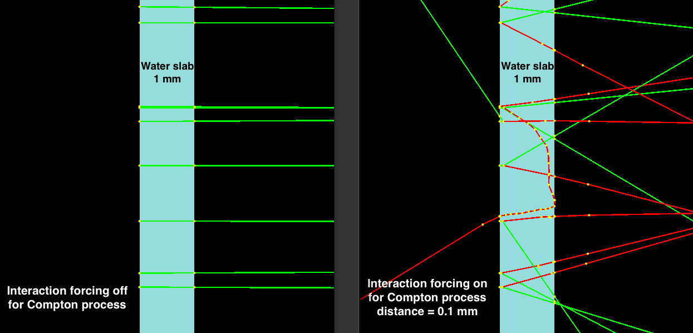

.. _vr_forced_interaction:

Forced interaction
-------------------

In this technique, photons are forced to interact by resampling the interaction probability using an scaling distance factor.

.. warning::

    The distance must be smaller than the thickness of the component assigned to the region.

This technique is applied per region, then the user is responsable to create and assign the components desired to a region. In addition, a scaling distance and physical process needs to be provided::

    s:Vr/PhotonInteractionForcing/Type = "ForcedInteraction"
    sv:Vr/PhotonInteractionForcing/ForRegion/BiasingRegion/ProcessesNamed = 1 "compt"
    dv:Vr/PhotonInteractionForcing/ForRegion/BiasingRegion/ForcedDistances = 1 0.1 mm

