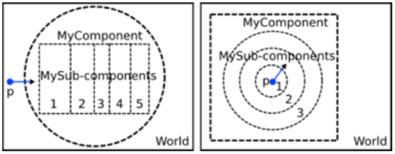
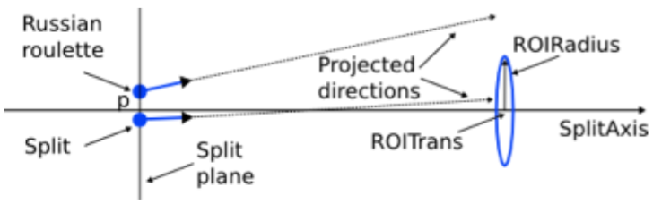
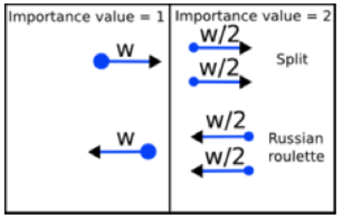

.. _vr_topas_split_geometry:

Topas split geometry variance reduction techniques
==================================================

One means to reduce variance is to split a particle and reduce it's statistical weight whenever it crosses some boundary. There are a number of ways to implement such an approach in topas.

Specify the Split Geometry
--------------------------

The geometry for variance reduction must be in a :ref:`parallel world <geometry_parallel>`. The type of component can be any standard solid (:ref:`geometry_dividable` or :ref:`geometry_generic`). The geometry must consist of a geometry component with a set of geometry sub-components as daughters. The sub-components must be located in such a way that the boundaries coincide. The split process or Russian roulette will occur at these boundaries. In the next figure a simple scheme is shown.

:ref:`time_feature` can be used to move or rotate the component or sub-components. But there is a restriction: the implementation of VR does not allow you to change the dimensions of the component and sub-components.

To set the geometry for VR::

    s:Vr/ParticleSplit/Component = "MyComponent"
    sv:Vr/ParticleSplit/SubComponents = n "MySubComp_1" ... "MySubComp_n"

Define the Splitting Technique
------------------------------

There are three variance reduction techniques available:

* :ref:`GeometricalParticleSplit <vr_geometrical_splitting>`
* :ref:`ImportanceSampling <vr_importance_sampling>`
* :ref:`WeightWindow <vr_weight_window>`

To chose a technique, use for example::

    s:Vr/ParticleSplit/Type = "GeometricalParticleSplit"

Each technique described in detail below.

.. _vr_geometrical_splitting:

Geometrical Particle Splitting
------------------------------

TOPAS variance reduction is further described in:

Ramos-Mendez et al, “Geometrical splitting technique to improve the computational efficiency in Monte Carlo calculations for proton therapy,” Med. Phys. 40, 041718 (2013)

This technique was designed for heavy charged particles. In this implementation, you must specify whether the beam entering into the sub-component has cylindrical symmetry or not. This is because the particles may or may not be randomly redistributed around the ``SplitAxis``.

The Russian roulette is applied in a particular direction. That is, at the split plane and prior to being split, the particle is subject to the Russian roulette if its direction does not point towards a Region of Interest (ROI). Then the radius of the ROI and its position on the ``SplitAxis`` must to be defined too. Further, the Russian roulette can be turned on/off at specific surfaces between sub-components.

.. code::

    s:Vr/ParticleSplit/Type = "GeometricalParticleSplit"
    s:Vr/ParticleSplit/SplitAxis = "zaxis"
    d:Vr/ParticleSplit/RussianRoulette/ROIRadius = 7.8 cm
    d:Vr/ParticleSplit/RussianRoulette/ROITrans = 10 cm
    bv:Vr/ParticleSplit/RussianRoulette = 2 "false" "true"

To set whether the region at each sub-component is symmetric or not and to define the corresponding split number::

    bv:Vr/ParticleSplit/Symmetric = 2 "false" "true"
    uv:Vr/ParticleSplit/SplitNumber = 2 8 8

In addition for this technique, geometrical Russian roulette will be played if a particle leaves the component or the world in a scheme similar to the :ref:`vr_importance_sampling` technique.

.. _vr_importance_sampling:

Importance Sampling
-------------------

In this technique, an importance value is assigned to each sub-component. If a particle is transported into a sub-component with a higher importance, then the particle is split. If it is transported into a sub-component with a lower importance, then Russian roulette is played. By default an importance value of 1 is automatically assigned to the parent component and to the world.

.. warning::

    It is desirable for the thickness of the sub-components to be similar to the mean free path of the physical process to be biased.

The sub-component importance values are defined by hand. For example, to split the particles by a factor of 2 between subsequent sub-components, one must to define::

    s:Vr/ParticleSplit/Type = "ImportanceSampling"
    uv:Vr/ParticleSplit/ImportanceValues = 5 1 2 4 8 16

.. _vr_weight_window:

Weight Window
-------------

In this technique, the split process or Russian roulette will be applied depending on the statistical weight of the particle. Every time that a particle crosses from a sub-component to the next one, the statistical weight is evaluated.

* Particles with weights greater than a lower bound and smaller than an upper bound will be tracked normally.
* Particles with weights smaller than a lower bound will be subject to Russian roulette. If it survives, the particle is tracked normally but its weight is increased.
* Particles with weights greater than an upper bound will be split, and the new particles will be assigned lower weights.

The split number and Russian roulette criteria are internally calculated from an energy map, a weight map, an upper limit factor and a survival factor. In simple geometries the maps can be input by hand.

The user must provide a double vector with upper energy bounds and a unitless vector with lower weight bounds for every sub-component: ``WeightMap`` and ``EnergyMap``. The inverse of a parameter named ``MaximumSplitNumber`` (100 by default) is used to specify the minimum survival probability to be used in Russian roulette. The parameter ``PlaceOfAction`` states whether the split process (or Russian roulette) will occur at the sub-component boundaries, at physics interactions or at both.

The follow configuration is equivalent to importance sampling with importance generator of 2::

    s:Vr/ParticleSplit/Type = "WeightWindow"
    uv:Vr/ParticleSplit/WeightMap = 4 1. 1. 0.125 0.0615
    dv:Vr/ParticleSplit/EnergyMap = 4 1. 1. 1. 1. GeV
    u:Vr/ParticleSplit/UpperLimitFactor = 1
    u:Vr/ParticleSplit/SurvivalFactor = 1
    i:Vr/ParticleSplit/MaximumSplitNumber = 100
    s:Vr/ParticleSplit/PlaceOfAction = "onBoundary"
    #Others options of PlaceOfAction: "OnCollision" and "OnBoundaryAndCollision"

.. image:: weight_window.png
