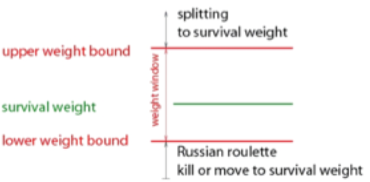

.. _vr_weight_window:

Weight Window
-------------

In this technique, the split process or Russian roulette will be applied depending on the statistical weight of the particle. Every time that a particle crosses from a sub-component to the next one, the statistical weight is evaluated.

* Particles with weights greater than a lower bound and smaller than an upper bound will be tracked normally.
* Particles with weights smaller than a lower bound will be subject to Russian roulette. If it survives, the particle is tracked normally but its weight is increased.
* Particles with weights greater than an upper bound will be split, and the new particles will be assigned lower weights.

The split number and Russian roulette criteria are internally calculated from an energy map, a weight map, an upper limit factor and a survival factor. In simple geometries the maps can be input by hand.

The user must provide a double vector with upper energy bounds and a unitless vector with lower weight bounds for every sub-component: ``WeightMap`` and ``EnergyMap``. The inverse of a parameter named ``MaximumSplitNumber`` (100 by default) is used to specify the minimum survival probability to be used in Russian roulette. The parameter ``PlaceOfAction`` states whether the split process (or Russian roulette) will occur at the sub-component boundaries, at physics interactions or at both.

The follow configuration is equivalent to importance sampling with importance generator of 2::

    s:Vr/ParticleSplit/Type = "WeightWindow"
    uv:Vr/ParticleSplit/WeightMap = 4 1. 1. 0.125 0.0615
    dv:Vr/ParticleSplit/EnergyMap = 4 1. 1. 1. 1. GeV
    u:Vr/ParticleSplit/UpperLimitFactor = 1
    u:Vr/ParticleSplit/SurvivalFactor = 1
    i:Vr/ParticleSplit/MaximumSplitNumber = 100
    s:Vr/ParticleSplit/PlaceOfAction = "onBoundary"
    #Others options of PlaceOfAction: "OnCollision" and "OnBoundaryAndCollision"

